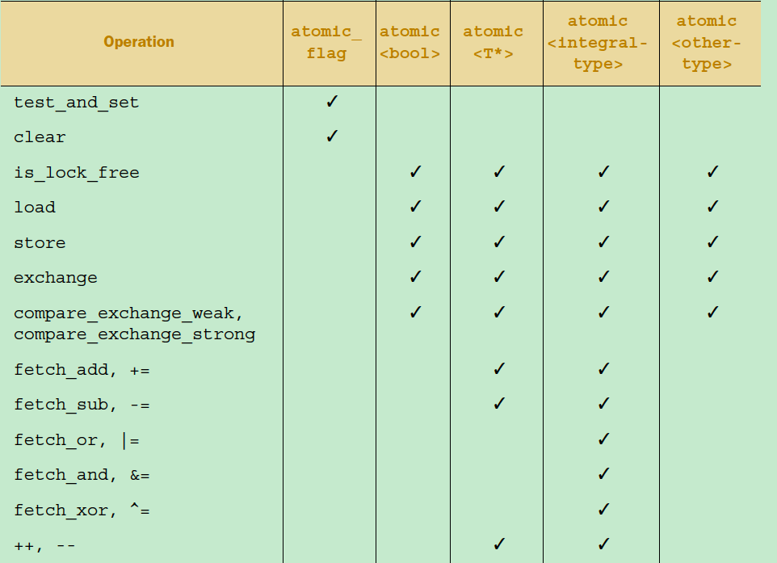

# 基本概念

- Wait-freedom: 

Wait-freedom means that each thread moves forward regardless of external factors like contention from other threads, other thread blocking. Each operations is executed in a bounded number of steps. It's the strongest guarantee for synchronization algorithms.

- Lock-freedom: 

Lock-freedom means that a system as a whole moves forward regardless of anything. Forward progress for each individual thread is not guaranteed (that is, individual threads can starve). It's a weaker guarantee than wait-freedom. 

- Termination-safety:

Waitfree, lockfree provide a guarantee of termination-safety. That is, a terminated thread does not prevent system-wide forward progress.

# 锁与Lock-Free

## 锁的问题

- Deadlock
- Priority Inversion
- Async-signal-safety
- Kill-tolerant availability

## Lock-Free的问题

- 复杂
- 性能不一定比锁好

# 原子操作

## 原子操作

原子操作是lock-free的基础。


## C++原子类型

c++的<atomic>头文件提供了基础的原子类型和原子类型模板。有些类型是Lock-Free的，有些不是，和平台和数据类型有关，可以通过is_lock_free()判断是否是Lock-Free的。非Lock-Free的类型内部使用了Mutex。

std::atomic_flag类型是一个 boolean flag。保证是Lock-Free的。



## 实现自旋锁

```c++
#include <atomic>
class spinlock_mutex
{
    std::atomic_flag flag;
public:
    spinlock_mutex():
        flag(ATOMIC_FLAG_INIT)
    {}
    void lock()
    {   // test_and_set 检测flag是否被设置，如果没有设置，设置并返回旧值
        while(flag.test_and_set(std::memory_order_acquire)); 
    }
    void unlock()
    {
        flag.clear(std::memory_order_release);
    }
};
```

# 重排序

## 两个层级的重排序

- 编译器
- cpu运行时指令重排序

## [Double-Checked单例问题](https://www.aristeia.com/Papers/DDJ_Jul_Aug_2004_revised.pdf )

```c++
Singleton* Singleton::instance() { 
    if (pInstance == 0) { // 1st test lock; 
         lock
        if (pInstance == 0) { // 2nd test 
           alloc,
           init
           assign
        }
    } 
    return pInstance; 
}
```

Step 1: Allocate memory to hold a Singleton object. 

Step 2: Construct a Singleton object in the allocated memory. 

Step 3: Make pInstance point to the allocated memory

compilers are sometimes allowed to swap steps 2 and 3。

# 一个问题

会有怎样的输出

```c++
#include <iostream>
#include <atomic>
#include <thread>
using namespace std;

atomic_int a{0};
atomic_int b{0};

void value_set() {
    t = 1
    a = t;
acquire
release
    b = 2;
}

void observer() {
    while(b != 2);
    cout << a << endl;
}

int main() {
    thread t1(value_set);
    thread t2(observer);
    t1.join();
    t2.join();
    return 0;
}
```

# 内存序

## 定义

memory order specifies how memory accesses, including regular, non-atomic memory accesses, are to be ordered around an atomic operation. Absent any constraints on a multi-core system, when multiple threads simultaneously read and write to several variables, one thread can observe the values change in an order different from the order another thread wrote them.


## **Happens-Before Relation**

- *Let A and B represent operations performed by a multithreaded process. If A* ***happens-before*** *B, then the memory effects of A effectively become visible to the thread performing B before B is performed.* 

- C++11, Java, Go and LLVM(编译器后端)都有的一个术语和概念。
- 单线程内，如果操作A的在操作B前，A happens-before B。
- 多线程，A Synchronizes-With B， 则A happens-before B。


- happens-before不是指令的执行顺序，而是指操作后，内存的变化对其他操作的影响。

    ```c++
    int a = 0;
    
    int b= 2; 
    
    如果只有一个线程执行，b可能先于a执行，但是a happens-before b.
    ```

    作用：明确内存访问/修改顺序，同步。

## **Synchronizes-With Relation**

-  the memory effects of source-level operations – even non-atomic operations – are guaranteed to become visible to other threads. This is a desirable guarantee when writing lock-free code
- 怎么理解：如果线程A已经执行了操作，线程B在之后需要能看到操作反应在内存上的效果。
- a thread only modifies a shared variable when there are no concurrent readers or writers. In such cases, atomic operations are unnecessary. We just need a way to safely propagate modifications from one thread to another once they’re complete. That’s where the ***synchronizes-with*** relation comes in. payload-修改的共享数据 和 guard-保护共享数据，标记是否有其他线程及是否完成。
- [java的volatile关键字提供](https://docs.oracle.com/javase/specs/jls/se13/html/jls-17.html#jls-17.4.4)**[Synchronizes-With保证。](https://docs.oracle.com/javase/specs/jls/se13/html/jls-17.html#jls-17.4.4)**
- A Write-Release Can *Synchronize-With* a Read-Acquire。反之不行。

```C++
struct Message
{
    clock_t     tick;
    const char* str;
    void*       param;
};

Message g_payload;
std::atomic<int> g_guard(0);

void SendTestMessage(void* param)
{
    // Copy to shared memory using non-atomic stores.
    g_payload.tick  = clock();
    g_payload.str   = "TestMessage";
    g_payload.param = param;
    // Perform an atomic write-release to indicate that the message is ready.re
    g_guard.store(1, std::memory_order_release);
}

bool TryReceiveMessage(Message& result)
{
    // Perform an atomic read-acquire to check whether the message is ready.
    int ready = g_guard.load(std::memory_order_acquire);  
    if (ready != 0)
    {
        // Yes. Copy from shared memory using non-atomic loads.
        result.tick  = g_payload.tick;
        result.str   = g_payload.str;
        result.param = g_payload.param;
        return true;
    }
    // No.
    return false;
}
```


## **Acquire and Releas**

- 可以认为是轻量级的，独立的内存屏障。
- *An* ***acquire fence*** *prevents the memory reordering of any* ***read*** *which precedes it in program order with any* ***read or write*** *which follows it in program order. 读。*
- *A* ***release fence*** *prevents the memory reordering of any* ***read or write*** *which precedes it in program order with any* ***write*** *which follows it in program order. 写。*

## 内存屏障

- 主要有4类


```c++
void SendTestMessage(void* param)
{
    // Copy to shared memory using non-atomic stores.
    g_payload.tick  = clock();
    g_payload.str   = "TestMessage";
    g_payload.param = param;
    // Release fence.
    std::atomic_thread_fence(std::memory_order_release);
    // Perform an atomic write to indicate that the message is ready.
    g_guard.store(1, std::memory_order_relaxed);
}
bool TryReceiveMessage(Message& result)
{
    // Perform an atomic read to check whether the message is ready.
    int ready = g_guard.load(std::memory_order_relaxed);
    if (ready != 0)
    {
        // Acquire fence.
        std::atomic_thread_fence(std::memory_order_acquire);
        // Yes. Copy from shared memory using non-atomic loads.
        result.tick  = g_payload.tick;
        result.str   = g_payload.str;
        result.param = g_payload.param;
        return true;
    }  
    // No.
    return false;
}
```


# 参考资料：

- c++ concurrency in action 2e
- https://preshing.com/
- http://www.1024cores.net/
- 深入理解C++11:C++11新特性解析与应用