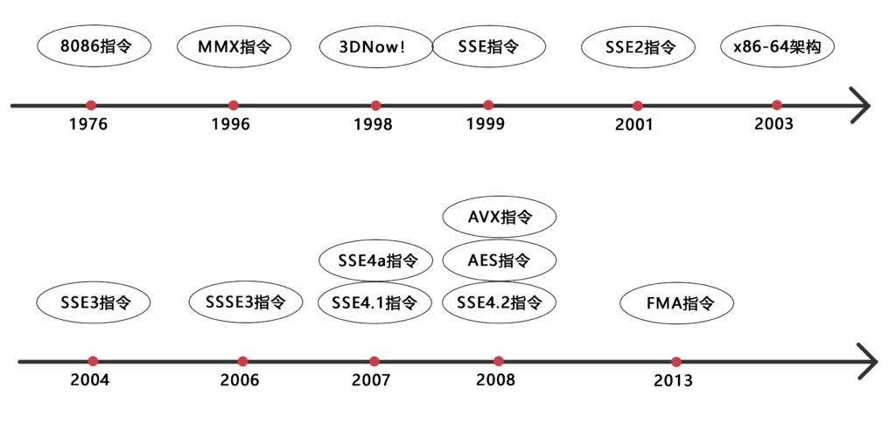

# 概念

现代处理器利用了指令级并行技术，同一时刻存在着多条指令同时执行，如指令流水线、乱序执行等。SSE/AVX指令支持向量化数据并行，一个指令可以同时对多个数据进行操作，同时操作的数据个数由向量寄存器的长度和数据类型共同决定。

从编程角度，我们常说的 SIMD(Single Instruction Multiple Data) 向量操作，通常是指使用 CPU 提供的 SIMD 指令集，来实现数据的向量化操作，SIMD 指令集是对 CPU 基本指令集的扩展。

向量指令，一次会同时执行多个对象的运算，思考方式可以先关注对单个对象的运算，然后扩展到向量。SIMD 指令是循环展开优化的常用思路。

# MMX/SSE/AVX

随着向量寄存器宽度和支持数据类型的发展，演进了多种向量指令集，每种指令集又有多种更细分的版本，如 SSE，SSE2，SSE3 等。更宽的寄存器宽度保持了对之前的兼容，如 128bit 的寄存器能够兼容 64bit 的向量指令集，所以各个指令集并不冲突，区别在于一条指令能同时处理的数据量和性能。

- MMX(Multi-Media Extension): 引入了 8 个 64bit 的寄存器，不支持浮点数。3DNow! 扩展了 MMX，支持了单精度浮点数。

- SSE(Streaming SIMD Extensions): 引入了 16 个 128bit 的寄存器，支持单精度浮点数，SSE2 支持了双精度浮点数，SSE3 引入了不对齐 loead（lddqu），SSE4 引入了更多的指令。

- AVX(Advanced Vector Extensions)：引入了 16 个 256bit 的寄存器，支持之前的所有浮点类型，AVX2 支持了整数类型。[AVX512F](https://en.wikipedia.org/wiki/AVX-512)， 添加 32 个 512bit 的寄存器。

通常 SSE 指令要求访问时内存地址对齐到向量长度，主要是为了减少内存或缓存操作的次数。



## 数据类型&寄存器

|            |                  |                 |
| ---------- | ---------------- | --------------- |
| 寄存器        | 数据类型             | 描述              |
| MM0~MM7    | __m64            | 64 位紧缩整数（MMX）   |
| XMM0~XMM15 | __m128           | 28 位紧缩单精度（SSE）  |
| __m128d    | 128 位紧缩双精度（SSE2） |                 |
| __m128i    | 128 位紧缩整数（SSE2）  |                 |
| YMM0~YMM15 | __m256           | 256 位紧缩单精度（AVX） |
| __m256d    | 256 位紧缩双精度（AVX）  |                 |
| __m256i    | 256 位紧缩整数（AVX）   |                 |

## 函数命名

其函数的命名可大致分为 3 个使用“_”隔开的部分，3 个部分的含义如下：

1. 第一个部分为_mm 或_mm256。_mm 表示其为 SSE 指令，操作的向量长度为 128 位或 128 位。

2. 第二个部分为操作函数名称，如_add、_load、mul 等，一些函数操作会增加修饰符，如 loadu 表示不对齐到向量长度的存储器访问。

3. 第三个部分为操作的对象名及数据类型，_ps(packed single-precision) 表示操作向量中所有的单精度数据；_pd(packed double-precision) 表示操作向量中所有的双精度数据；_pixx 表示操作向量中所有的 xx 位的有符号整型数据，向量寄存器长度为 64 位；_epixx 表示操作向量中所有的 xx 位的有符号整型数据，向量寄存器长度为 128 位；_epuxx 表示操作向量中所

如_mm256_add_ps表示使用256位向量寄存器执行单精度浮点加法运算。

## 常用指令介绍

- __m128i _mm_loadu_si128 (__m128i const* mem_addr)

从 mem_addr 加载 128 位 bits 的整数。

- __m128i _mm_set1_epi8 (char a)

构造 [u8]，每个的值为 a。

- __m128i _mm_setr_epi8 (char e15 ... char e0)

构造 [u8]，每个的值为对应位置的参数，e15 对应 dst[0]。

- __m128i _mm_and_si128 (__m128i a, __m128i b)

向量版与运算。

- __m128i _mm_srli_epi16 (__m128i a, int imm8)

向量版 16 位整数右移操作，imm8 指定了右移位数，如果大于 15，对应结果为 0。

- __m128i _mm_cmplt_epi8 (__m128i a, __m128i b)

向量版小于比较。如果向量 a 的某个元素小于向量 b 的对应元素，在结果向量中的对应位置为 0xFF，否则为 0。

- __m128i _mm_cmpeq_epi8 (__m128i a, __m128i b)

向量版比较运算。如果相等，对应位置设置为 0xFF， 否为 0。

- __m128i _mm_blendv_epi8 (__m128i a, __m128i b, __m128i mask)

向量版三目运算符。a 和 b 是两个 128 位的向量，分别包含 16 个 8 位整数。mask 是一个 128 位的向量，每个元素只能是 0 或 0xFF，其中 0xFF 表示选择 b 中的元素，0 表示选择 a 中的元素。

- int _mm_movemask_epi8 (__m128i a)

返回一个 16bit 的整数，看看每个 byte 的最高位是否为 1，如果为 0，对应 dst 的 bit 设置为 0 。

- __m128i _mm_shuffle_epi8 (__m128i a, __m128i b)(pshufb)

向量版 [u8] index 查找。

对 a 的每个字节按照 b 的指示进行洗牌（重新排列）。b 指定了 a 中字节的重新排列顺序，b 每个字节的后 4 个 bit 指定了 a 的 index，另外，如果 b 字节中的最高位被设置，返回的对应字节设置为 0。

pshufb 实现了 byte 到 byte 的映射，可以作为 map 的查找使用。a 是 16 字节的数组， b 后 4bit 作为 index，查找范围 [0，15]。特殊的是如果 b 的最高位为 1，则查找结果返回为 0。

```rust
// 逻辑对应的 rust 代码
fn mm_shuffle_epi8(a: [u8; 16], b: [u8; 16]) -> [u8; 16] {
    let mut r = [0u8; 16];
    for i in 0..16 {
        // if the most significant bit of b is set,
        // then the destination byte is set to 0.
        if b[i] & 0x80 == 0u8 {
            r[i] = a[(b[i] % 16) as usize];
        }
    }
    r
}
```

# 案列

## 校验非法字符

给定一个非法字符集合，判断 string 中是有有非法字符。
常规的做法，构造一张 lookup 表，char index 的 bit 为 1 表示合法，为 0 表示非法。

SIMD 算法也需要去查表，只是一次可以进行 16 个字符的查找。前面介绍的 pshufb 可以用来做查表，但 pshufb 用来做 index 的只有低 4bit，索引范围只能[0-15]，无法满足[0-127] 的查找范围，故需要将查找表拆成二维表，进行两次查找，先通过低 4bit 查找所在行，在通过后 3bit 在行中查找对应。两次查找都可以向量化，一次对 16 个字符查找。

构造二维查找表：

```C++
std::vector<uint8_t>
invalid_chars_table(const std::unordered_set<char> &invalid_chars) {
  std::vector<uint8_t> table(16, 0);
  // 可见字符
  for (uint8_t i = 32; i < 127; i++) {
    if (invalid_chars.find(i) == invalid_chars.end()) {
      uint8_t &row = table[i & 0x0F];
      uint8_t high_nibble = i >> 4;
      row |= (1 << high_nibble);
    }
  }
  return table;
}
```

校验实现

```C++
static constexpr uint8_t g_smTable[] = {0x01, 0x02, 0x04, 0x08, 0x10, 0x20,
                                        0x40, 0x80, 0x01, 0x02, 0x04, 0x08,
                                        0x10, 0x20, 0x40, 0x80};

static constexpr uint8_t g_hmTable[] = {0x0f, 0x0f, 0x0f, 0x0f, 0x0f, 0x0f,
                                        0x0f, 0x0f, 0x0f, 0x0f, 0x0f, 0x0f,
                                        0x0f, 0x0f, 0x0f, 0x0f};

bool is_valid_string(const std::string &s,
                     const std::vector<uint8_t> &s_table) {
  static const uint8_t pack_size = 16;
  // 加载查找表，16*8 的二维表
  __m128i bitmap = _mm_loadu_si128((__m128i *)s_table.data());
  // 
  __m128i shift_mask = _mm_loadu_si128((__m128i *)g_smTable);
  // 每个字节为 0x0F, 用于消除清 0 高 4 bit
  __m128i high_mask = _mm_loadu_si128((__m128i *)g_hmTable);
  // 16 个字符一组
  auto loop = s.size() / pack_size;
  const char *ptr = s.data();
  for (uint8_t i = 0; i < loop; i++) {
    // 加载 16 个输入字符
    __m128i input = _mm_loadu_si128((__m128i *)ptr);
    // 向量查找对应行，每行8bit, 共 16 行 
    __m128i rows = _mm_shuffle_epi8(bitmap, input);
    // _mm_srli_epi16 对输入 2 个字符一组右移 4 位，注意是按照 16 字节右移，
    // 右移后，高 4 位包含了前一个字符的低 4 位，还需要通过与 0x0F 与消除。
    __m128i hi_nibbles = _mm_and_si128(_mm_srli_epi16(input, 4), high_mask);
    // hi_nibbles 得到了 row 中 index，但没法直接通过 hi_nibbles 作为 index 去 rows 中查找，
    // 因为 rows 是按 low_nibbles 排列的。
    // 通过将 hi_nibbles 转化为对应 bit 设置为 1 的 byte，然后与 rows 与运算。
    __m128i cols = _mm_shuffle_epi8(shift_mask, hi_nibbles);
    // rows 代表了 low_nibbles 对应的行，cols 代表了 hi_nibbles 作用 index 时，bit 被设置的 bytes。
    // 通过与，如果对应 bit 为 1，则合法。
    __m128i tmp = _mm_and_si128(rows, cols);
    // 判断是否和 cols 相等，如果 rows 有对应 bit 为 0，则一定不相等。
    __m128i result = _mm_cmpeq_epi8(tmp, cols);
    // 有非法字符时，result 中有 byte 不是 0xFF, 通过得到每个 byte 的最高位，可以校验是否有 0x00 byte
    size_t mask = _mm_movemask_epi8(result);
    if (mask != 65535) {
      return false;
    }
    ptr += pack_size;
  }

  // 不足 16 字符部分，采用常规校验
  for (size_t i = loop * pack_size; i < s.size(); i++) {
    auto lower = s[i] & 0x0f;
    auto higher = s[i] >> 4;
    if ((s_table[lower] & (1 << higher)) == 0) {
      return false;
    }
  }
  return true;
}
```

# Ref

http://0x80.pl/articles/simd-byte-lookup.html 介绍了更为复杂的全字节的校验算法，范围从[0-256]。
