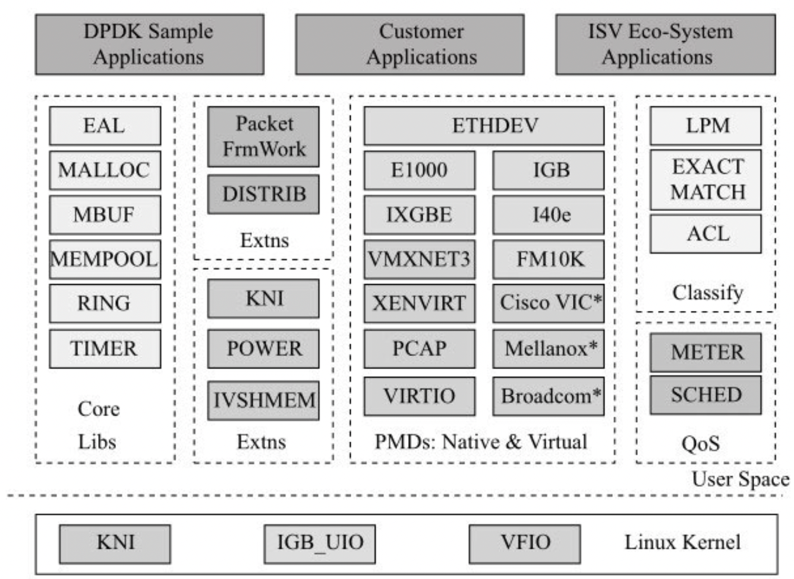

# TCP 发送很慢

问题来自于实际生产环境下遇到的一个问题，某一个集群监控延迟 30min+，伴随丢点，包括打点 agent 本身的自监控，延迟节点上的指标 QPS 不高。

通过 log 发现，两个包之间的发送间隔较长，看上去是网络发送慢。整个发送链路为：业务 -> agent -> telegraf ->  influxdb。agent 和 telegraf 运行在一台设备上，通过 TCP 通信，理论上来说，应该会非常快。

检查了 telegraf 的 log 和运行状态，没有发现异常。通过 ss -tiepm 发现 agent 和 telegraf 之间的平均 rtt 高达 21 ms，怀疑是系统的问题。


后经过抓包采样，确认了是 TCP 协议栈慢的问题。后来注意到几个 core 的 cpu 利用率基本都是 100%，发现了业务采样了 DPDK ，业务修改了业务的绑核策略，导致了 telegraf 和 agent 跑在被 DPDK 绑核的 CPU 上，导致 DPDK poll 和 telegraf，agent 抢核，严重影响了网络收发包的性能，造成指标采集上报的性能上不去

之前只是听过 DPDK， 并没有实际了解过 DPDK，随打算趁机学习一下。DPDK 要解决的问题和优化方法，也许能对业务性能优化有一定启发。

# DPDK 介绍

> The Open Source [Data Plane Development Kit(DPDK)](https://www.dpdk.org/) Accelerating Network Performance.

DPDK 是什么？按照官网的描述，DPDK 是在通用 cpu 上加速包处理的开发套件，支持多种 cpu 架构。

包处理指在这特指网络包处理，支撑包处理的主流硬件平台大致可分为三个方向

- 硬件加速器。如 ASIC 和 FPGA，具有高性能和低成本的特点。对于本身固化功能，通常可以卸载到硬件加速单元进一步提升性能。
- 网络处理器 NPU。专门为处理数据包而设计的可编程通用处理器，常被应用于包处理、协议分析、路由查找、声音/数据的汇聚、防火墙、QoS 等，有专门的微码编程语言。
- 多核处理器 CPU。

硬件加速器和网络处理器，由于专注于包处理，在性能和成本上相对于 CPU 有着天然的优势，但它们本身也有较多的问题。硬件加速器灵活性和扩展性不够、开发费用高、开发周期长。网络处理器可编程，但各个平台的微码规范不尽相同，生态不够完善。更重要的是，硬件在大规模升级方面存在天然的困难。

DPDK 最初的动机，是为了证明 intel 多核处理器能够支撑高性能数据包处理。当前的多核处理器正在走向 SOC 化，在 SOC 上往往会集成众多加速单元和网络接口。可固化的处理交由加速单元完成，灵活的业务逻辑则由众多的通用处理器完成，有效地融合了软硬件各自的优势。

DPDK 证明了通用处理器在包处理领域的能力，网络负载与虚拟化的融合又催生了 NFV（网络功能虚拟化）的潮流。DPDK 以基础软件库的形式，为上层应用的开发提供一个高性能的基础 I/O 开发包，使得能够将由硬件处理的功能得以软化，并确保有足够的性能。



DPDK 由一系列的库组成，是一个开发数据平面应用的完整框架。

- cores 提供了核心的库。 Environment Abstraction Layer （EAL） 提供了通用的接口隐藏硬件和操作系统的细节,包括 DPDK 的加载，core 亲和性和独占，系统内存分配/归还，锁，PCI 总线访问，trace 与 debug，中断处理，多线程/进程等，其他库正如名字所示。
- Poll Mode Driver**（**PMD）提供运行在用户空间的驱动，用于配置硬件设备和相应的队列。支持 run-to-completion 和 pipe-line 两种模式。
- Extns 提供了平台相关特性，运行时频率调整（POWER），KNI（Kernel Network Interface）与内核建立快速通道，Packet Framework 和 DISTRIB 为多核流水线处理模型提供框架。
- KNI 提供给用户一个使用 Linux 内核态的协议栈以及传统的 Linux 网络工具（如 ethtool、ifconfig）的通道。IGB_UIO 在初始化过程中将网卡硬件寄存器映射到用户态，通过 UIO 或 VFIO 技术将 PCI 设备地址映射到用户空间。

# 包处理流程

包通常由内核完成处理，当网络包达到网卡时，通常会进行如下的处理。

1. 接收前，CPU 填充缓冲地址到接收侧描述符。
2. 网卡读取接收侧描述符获取缓冲区地址，通过 DMA 将包的内容写到缓冲区地址，回写接收侧描述符更新状态，确认包内容已写完。
3. 网卡发送中断，唤醒处理器，调用网络驱动注册的中断处理。
4. CPU 读取接收侧描述符以确定包接收完毕。调用 poll 将收到的包填充协议栈的读写缓冲区数据结构，交由协议栈处理。
5. 如果最终应用在用户态，数据从内核搬移到用户态，如果最终应用在内核态，在内核继续进行。

按照上面的流程，每个报文就会触发一个中断，导致系统会有非常大的中断开销。Linux 内核中引入了 NAPI 机制，其策略是系统被中断唤醒后，尽量使用轮询的方式一次处理多个数据包，直到网络再次空闲重新转入中断等待。

将包从内核的缓冲区复制到用户缓冲区，有系统调用以及数据包复制的开销。对于有些网络功能来说，TCP/IP 协议栈并不是必须的。传统的分时调度，容易导致 cache 失效。从中断触发，到应用感知，往往也会经过很长的处理路径，实时性不高。

DPDK 针对上述的一些问题，通过将大部分包处理放在的用户空间，以及其他的优化手段，如 huge page，绑核，poll 模式，充分利用 cache 等的方式，实现了对包处理的加速。如今 DPDK 吞吐能力上限已经不再受限于 CPU 的核数，当前瓶颈在于 PCIe（IO 总线）的 IO 能力。

# DPDK 的优化

## 概述

1. poll 模式。类似内核的 NAPI，避免中断上下文切换的开销。
2. 用户态驱动。规避了不必要的内存拷贝和系统调用。
3. 亲和性与独占。避免线程在不同核间频繁切换导致因 cache miss 和 cache write back 造成的性能损失。
4. 降低访存开销。利用内存大页降低 TLB miss，利用 NUMA 感知避免额外的访存延迟，充分利用 cache。
5. 利用硬件加速。如卸载 checksum，DDIO（Data Direct I/O） 减少内存访问等。
6. 实现优化。如 cache line 对齐， per core data 避免线程间的数据竞争，数据预取，SIMD 并行，无锁 ring。

## 内存

 Huge Page。 DPDK 所有的内存都是从巨页里分配，通过内存池（Mempool）的进行管理。使用大页，减少了页表的层级，更重要的是减少了 TLB 不命中的概率。

利用 NUMA 特性，本地设备本地处理，Per-core memory。每个 core 有自己的内存，减少了 NUMA 的远程访问，也避免了多个核访问同一个 Cache 行。

Cache 预取。通常，cache 对程序员是透明的。硬件能够在满足特定条件下进行预取，但并不是所有场景下都能满足硬件预取条件，另外也可能预取错误，反而降低执行的效率。 一些体系架构提供能够对 Cache 进行预取的指令，能进一步加快程序执行。mmintrin.h 提供了 _mm_prefetch 等相关函数。

DDIO 技术。当处理器想要对数据进行更新时，需要从内存中将数据读入缓存，修改后将数据从高速缓存中写回内存，再通知网卡进行发送。intel 的 DDIO 使外部网卡和 CPU 通过 LLC（*Last level cache*）直接交换数据，绕过了内存这个相对慢速的部件。更新数据后，会直接通知 NIC 来读取报文，利用 DDIO 技术，I/O 访问可以直接将 Cache 的内容送到 PCI 总线上，减少了 Cache 写回时等待的时间。

## CPU

减少 cache 一致性的负担。DPDK 尽量避免多个核访问同一个内存地址或者数据结构，对于某些数据结构，每个核都单独定义一份，这样每个核都只访问属于自己核的备份。以网卡为例，网卡设备一般都具有多队列，DPDK 为每个核都准备一个单独的接收队列/发送队列，避免竞争。

core 亲和性。task_struct 结构中的 cpus_allowed 位掩码，指定了线程可以被调度的 cores，sched_set_affinity api 可以修改位掩码。 通过指定亲和性，能够减少 cache 失效，特别是 NUMA 下。DPDK EAL 中提供了 lcore 线程，默认会根据指定的  coremask 生成相应个数的 lcore   并 1:1 亲和到 cpu 逻辑核上。

线程独占。虽然可以通过亲和性来避免跨核任务中的切换开销，但若希望进一步减少线程切换的开销，则可以采用线程独占一个 core。Linux isolcpus 启动参数指定了不参与调度的 cores，之后通过 taskset 命令指定哪些程序在这些核心中运行，从而实现线程独占。

SIMD. 如 DPDK 利用 SIMD 来实现 memcpy，利用 SIMD 来实现并行化包收发。

无锁编程。如无锁环形队列。

## 软硬结合

减少 MMIO（Memory-mapped I/O）访问。网卡有收发描述符环形队列，由一组控制寄存器（head，tail，base，size）和一块物理上连续的缓存构成。 DMA 会读取/更新网卡的寄存器以判断是否接收成功或者发送成功。 网卡驱动也会填充缓冲区地址到描述符，移动尾指针，判断完成状态位等。而 MMIO 的操作需经过 PCIe 总线的传输，由于数据带宽有限和延时，PCIe 事务有效传输率不高。接收时，DPDK 通过合并批处理的方式，较少 MMIO 的频率。 DPDK 在空值率超过一定值后才批量分配并重填描述符，减少 MMIO。另外，通过合并写描述符为一个 cache line 大小作为 PCIe 的事务请求，提高带宽利用率。发送时，通过批量方式回写寄存器。

硬件卸载。硬件卸载功能是将某些功能下移到硬件实现，网卡驱动需要提供相应的 API 给上层应用，通过调用 API 驱动硬件完成相应的工作。按照功能分类，可分为计算及更新功能（如 TCP checksum）、分片（如 TCP 分片）、组包（如 TCP 组包）功能。

充分利用平台特性。如利用内存控制器多通道（memory channel），实现内存并发访问，利用 cpu 最新指令，利用网卡在发送侧调度等。

## 轮训模式

DPDK 采用了轮询或者轮询混杂中断的模式来进行收包和发包。

轮训模式下，DPDK 所有的收发包有关的中断在物理端口初始化的时候都会关闭。每一个收包队列，DPDK 都会有一个对应的软件线程负责轮询里面的收包描述符的收包成功的标志。

轮训模式避免了上下文切换的开销，避免了中断的开销，但实际应用可能存在潮汐效应，某些时间段流量很低，这时轮训有很大的浪费。DPDK 提供了混合模式，类似 NAPI 的思路。

混合模式下，可以指定策略条件来决定是否进入休眠模式，后续的包通过收包中断再次被唤醒，唤醒后就会关闭中断，再次轮训。

DPDK 的混合中断轮询机制是基于 UIO 或 VFIO 来实现，VFIO 支持队列级别的中断，UIO 共享一个中断。

# DPDK 包处理框架

packet framework 提供了在 core libs 外提供包处理框架，方便开发包处理应用。提供了两种处理模型

- run to completion 模型：所有的逻辑都在一个 core 上完成，通过多核实现水平扩展。在包处理上，需要每个核都响应中断，效率相对不高，而且无法利用其他计算单元。
- pipeline 模型：将一个功能分解成多个独立的阶段，不同阶段间通过队列传递。通过 pipeline 模型，可以把 CPU 密集的操作放在一个微处理引擎上执行，将 I/O 密集的操作放在另外一个微处理引擎上执行。

DPDK 提供了几种内置的 pipeline 组件，如 Routing，Packet I/O，应用可以直接使用，也可以开发自己的 pipeline。

# DPDK 的应用

NFV（Network Function Virtualization）网络功能虚拟化。通过软件替代各种类型的专有硬件，如防火墙，NAT 等，解决硬件开发周期长，难升级的痛点。云计算需要实现动态扩容，通过虚拟化技术的 NFV，具备了弹性能力。

https://www.dpdk.org/ecosystem/ 列出了基于 DPDK 的应用，比如 DPVS 4 层负载均衡，F-Stack 用户态 TCP 协议栈，GateKeeper DDOS 防御等。

# DPDK 案例

接下来通过分析 DPDK 自带比较简单的 skeleton 例子，来学习下 DPDK 实际的开发应用。

skeleton 是一个二层转发应用，采用纯 poll 模式， run to completion 模型，是其他例子如 l2fwd, l3fwd 的基础。主要工作仅仅是把收到的包转发到另一个端口发出。

```c++
/* Main functional part of port initialization. 8< */
static inline int port_init(uint16_t port, struct rte_mempool *mbuf_pool) {
  // 端口配置
  struct rte_eth_conf port_conf;
  // 每个端口的 ring 个数
  const uint16_t rx_rings = 1, tx_rings = 1;
  // ring 的大小
  uint16_t nb_rxd = RX_RING_SIZE;
  uint16_t nb_txd = TX_RING_SIZE;
  int retval;
  uint16_t q;
  // 以太网卡的设备信息
  struct rte_eth_dev_info dev_info;
  // tx ring 配置信息
  struct rte_eth_txconf txconf;
  // 端口是否有效
  if (!rte_eth_dev_is_valid_port(port))
    return -1;

  memset(&port_conf, 0, sizeof(struct rte_eth_conf));
  // 获取设备信息
  retval = rte_eth_dev_info_get(port, &dev_info);
  if (retval != 0) {
    printf("Error during getting device (port %u) info: %s\n", port,
           strerror(-retval));
    return retval;
  }
  // tx_offload_capa 是网卡发送端的硬件卸载能力，即哪些可以放在网卡上去做，
  // 通过 port_conf.txmode.offloads 来告知 DPDK 使用哪些硬件卸载能力
  // RTE_ETH_TX_OFFLOAD_MBUF_FAST_FREE 表示是否快速释放 mbuf，需要应用保证 mbuf
  // 来自同一个 mempool.
  if (dev_info.tx_offload_capa & RTE_ETH_TX_OFFLOAD_MBUF_FAST_FREE)
    port_conf.txmode.offloads |= RTE_ETH_TX_OFFLOAD_MBUF_FAST_FREE;

  // 配置以太网设备
  // port 标志哪一个 dev，rings 表示环形队列的个数
  retval = rte_eth_dev_configure(port, rx_rings, tx_rings, &port_conf);
  if (retval != 0)
    return retval;

  // 检查网口是否有足够的 nv_rxd, nv_txd 指定的描述符
  retval = rte_eth_dev_adjust_nb_rx_tx_desc(port, &nb_rxd, &nb_txd);
  if (retval != 0)
    return retval;

  // 配置 rx 队列
  // 从指定的 socket id mem 分配 nb_rxd 个描述符并初始化，关联上 mbuf
  for (q = 0; q < rx_rings; q++) {
    retval = rte_eth_rx_queue_setup(
        port, q, nb_rxd, rte_eth_dev_socket_id(port), NULL, mbuf_pool);
    if (retval < 0)
      return retval;
  }

  // 配置 tx 队列
  txconf = dev_info.default_txconf;
  txconf.offloads = port_conf.txmode.offloads;
  for (q = 0; q < tx_rings; q++) {
    retval = rte_eth_tx_queue_setup(port, q, nb_txd,
                                    rte_eth_dev_socket_id(port), &txconf);
    if (retval < 0)
      return retval;
  }

  // 启动以太网网口
  retval = rte_eth_dev_start(port);
  if (retval < 0)
    return retval;

  // 打印 port 的 mac 地址
  struct rte_ether_addr addr;
  retval = rte_eth_macaddr_get(port, &addr);
  if (retval != 0)
    return retval;

  printf("Port %u MAC: %02" PRIx8 " %02" PRIx8 " %02" PRIx8 " %02" PRIx8
         " %02" PRIx8 " %02" PRIx8 "\n",
         port, RTE_ETHER_ADDR_BYTES(&addr));

  // 开启promiscuous mode
  // 可以拦截并完整读取每个到达的网络数据包
  retval = rte_eth_promiscuous_enable(port);
  if (retval != 0)
    return retval;

  return 0;
}

/*
 * The lcore main. This is the main thread that does the work, reading from
 * an input port and writing to an output port.
 */

/* Basic forwarding application lcore. 8< */
static __rte_noreturn void lcore_main(void) {
  uint16_t port;

  // 检查 NUMA 是否匹配
  RTE_ETH_FOREACH_DEV(port)
  if (rte_eth_dev_socket_id(port) >= 0 &&
      rte_eth_dev_socket_id(port) != (int)rte_socket_id())
    printf("WARNING, port %u is on remote NUMA node to "
           "polling thread.\n\tPerformance will "
           "not be optimal.\n",
           port);

  printf("\nCore %u forwarding packets. [Ctrl+C to quit]\n", rte_lcore_id());

  // poll 模型不断收包/转发
  for (;;) {
    // 接收包，转发到另一个端口
    // mapping is 0 -> 1, 1 -> 0, 2 -> 3, 3 -> 2, etc.
    RTE_ETH_FOREACH_DEV(port) {

      // 从队列 0 收包，保存在 bufs 中，nb_rx 是实际的包个数
      struct rte_mbuf *bufs[BURST_SIZE];
      const uint16_t nb_rx = rte_eth_rx_burst(port, 0, bufs, BURST_SIZE);

      if (unlikely(nb_rx == 0))
        continue;

      // 转发到另一个端口队列 0，nb_tx 是转发成功的包数
      const uint16_t nb_tx = rte_eth_tx_burst(port ^ 1, 0, bufs, nb_rx);

      // 释放没有成功发送的包
      if (unlikely(nb_tx < nb_rx)) {
        uint16_t buf;
        for (buf = nb_tx; buf < nb_rx; buf++)
          rte_pktmbuf_free(bufs[buf]);
      }
    }
  }
}

/*
 * The main function, which does initialization and calls the per-lcore
 * functions.
 */
int main(int argc, char *argv[]) {
  struct rte_mempool *mbuf_pool;
  unsigned nb_ports;
  uint16_t portid;

  // 进行 EAL 初始化
  //
  // DPDK 应用除了自己的参数外, 还有一批 DPDK EAL 提供的参数,
  // 例：app -l 0-3 -n 4 -- {应用参数}
  // 前面部分是 EAL 参数, -l 表示在哪些 core 上运行，-n 表示内存通道。
  // ret 表示解析的 EAL 参数个数, rte_eal_init会将 argv[0] 拷贝到 EAL
  // 的最后一个参数, 使得下面调整 argv 后，第一个参数依然还是程序名。
  //
  // EAL 参数列表:
  // https://doc.dpdk.org/guides/linux_gsg/linux_eal_parameters.html
  //
  // init 主要工作:
  // 1. 根据参数创建线程，每 core 一个，设置亲和性，设置线程在等待状态
  // 2. 从系统获取 hugepage，init mem，init mempool
  // 3. pci 初始化，中断初始化，timer 初始化，队列初始化
  // 4. 轮训设置初始化，主线程初始化，建立主从线程通道
  int ret = rte_eal_init(argc, argv);
  if (ret < 0)
    rte_exit(EXIT_FAILURE, "Error with EAL initialization\n");
  // 摘掉 EAL 参数
  argc -= ret;
  argv += ret;

  // 获取可用的以太网端口个数
  nb_ports = rte_eth_dev_count_avail();
  if (nb_ports < 2 || (nb_ports & 1))
    rte_exit(EXIT_FAILURE, "Error: number of ports must be even\n");

  // 创建 mbuf 线程池, rte_mbuf 用于保存网络数据包.
  // 每个端口 NUM_MBUFS 个 mbuf，每个 mbuf MBUF_CACHE_SIZE 大小.
  // rte_socket_id 返回当前 core 的物理 socket(socket 表示一个 cpu 插槽),
  // 指示 NUMA 下从当前 socket 下内存条分配.
  mbuf_pool = rte_pktmbuf_pool_create(
      "MBUF_POOL", NUM_MBUFS * nb_ports, MBUF_CACHE_SIZE, 0,
      RTE_MBUF_DEFAULT_BUF_SIZE, rte_socket_id());

  if (mbuf_pool == NULL)
    rte_exit(EXIT_FAILURE, "Cannot create mbuf pool\n");

  // 循环执行没被使用以太网网口的初始化
  RTE_ETH_FOREACH_DEV(portid)
  if (port_init(portid, mbuf_pool) != 0)
    rte_exit(EXIT_FAILURE, "Cannot init port %" PRIu16 "\n", portid);

  // 系统的逻辑核数, 但这个例子实际只有一个主线程
  if (rte_lcore_count() > 1)
    printf("\nWARNING: Too many lcores enabled. Only 1 used.\n");

  // 主线程 poll
  lcore_main();

  // EAL 相关清理
  rte_eal_cleanup();

  return 0;
}
```

# 参考

- [DPDK  官网](https://www.dpdk.org/ecosystem/)
- 《深入浅出 DPDK》
