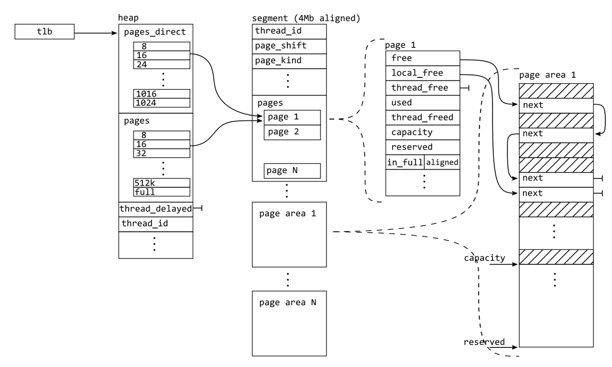

# 内存管理

Allocator 主要解决的问题包括：

- 高性能的内存分配
- 避免内存碎片化，包括内部碎片和外部碎片
- Slab 系统用来实现对象缓存池
- 安全性保障
-  统计分析能力

高性能的内存分配是 allocator 永恒的主题。目前 allocator 的一般思路包括：

- 减少线程间的竞争与同步，如 thread local cache，划分不同的 arena
- 按照 size 和 object 划分的 slab 系统
- 伙伴系统来减少外部碎片化
- lock-free 的实现优化
- 对 huge allocate 进行特殊实现

# Mimalloc 原理概述

先介绍下 mimalloc 中的几个术语：

- heap：每个线程一个默认 heap，线程所有的内存分配都经由本线程的 heap 完成分配。mimalloc 提供的 mi_heap_new api 也允许为线程创建另外的 heap，通过 mi_heap_malloc 完成在该 heap 上进行内存分配，mi_malloc 会在默认 heap 上进行分配。
- segment：一个 segment 是一块大的内存(8MB on x64)，是实际从 os 中分配内存，然后用于 malloc 的内存区域，heap 只是用来管理 segment 和 page。2.0 之后的版本，一个 segment 被划分为多个 slice，多个 slice 可以组成一个 page，segment 对 slice 和 page 进行管理。同时 segments 的 metadata 也保存在 segment 开头几个 slice 中。一个 heap 可以有多个 segment，但 heap 并不对 segment 进行直接管理，heap 对 page 进行管理，但通过 page 可以得到 page 所在的 segment。
- page：非内核的 memory page，指一大块内存，可能包含多个 memory page。 一个 segment 按照不同的 block size 可以划分为不同大小的 pages，一个 page 由一个或多个 slices 组成。一个 page 内，划分为多个同大小的 block， page 由 3 个 free-list（free-list, local-free-list, thread-free-list）对 blocks 进行管理。
- block：最小的分配单元。一个 page 被划分为多个同大小的 blocks。
- tld: 线程局部数据（mi_tld_t），用来保存线程相关数据，如线程的 heap 指针等。
- arena: 不同的 allocator 有不同的含义，在 mimalloc 中，arena 代表 os 内存用于分配 large-block( 大于等于4MiB)。不同于 segment，arena 是被多个线程共享的。可能需要 arena 的场景包括将已有的大块内存整合进 mimalloc（可能通过 sbrk 获得的内存，mimalloc 主要使用 mmap），使用方式可以参考 arena 提供的相关 api，本篇不会重点介绍 arena。

Mimalloc 为每个线程分配一个 heap，所有的分配和释放都只能通过该 heap(除非线程终止，会 abondon 到主线程)，从而减少线程间的竞争，同时增加了局部性。page 有 3 个 free-list:

- free-list: 该 page 可用的 block 链表
- local-free-list：本线程已经 free 的 block 链表，当 free-list 为空时，会和 free-list 进行交换
- thread-free-list：其他线程 free 的 block 链表

通过 3 个 free-list 能尽可能的减少线程间的竞争。以上只是非常概括性的总结，真正的实现比这复杂，不是简单概括能够说清楚的。下面将先从数据结构进行分析，搞清楚各个数据结构之间的关系和相互作用，然后基于 linux 系统，从具体的场景进行源码分析。

# 主要数据结构

## Heap

按照内存的划分关系：heaps -> segments -> pages -> blocks。

> 注：下面这种图是 1x 的版本，2x 版本把 segment 按照 slice 进行划分，但其他基本没有变化，二者的主要区别可以参考 https://zhuanlan.zhihu.com/p/365094561



每个线程有自己的 heap，主线程的 heap 结构是静态初始化的，其他线程的 heap 在线程创建时进行分配。heap 自身的内存仅能从创建它的线程 allocate 和 deallocate，线程终止时，heap 被 deallocate。_mi_heap_default 是一个 thread-local 指针，指向默认 heap。

```C++
// A heap owns a set of pages.
struct mi_heap_s {
  // 所属 tld
  mi_tld_t*             tld;
  // 一个加速 malloc 的优化，数组元素指向一个 page，
  // 该 page 可能包含有 index 大小的 free blocks
  mi_page_t*            pages_free_direct[MI_PAGES_DIRECT];  // optimize: array where every entry points a page with possibly free blocks in the corresponding queue for that size.
  // page 队列，每个 page 中 block 的 size 相同
  // heap 并不直接对 segment 进行管理， page 可能属于不同的 segment
  // pages 不一定都有可用的 block
  // pages 最后一个位置是没有 free block 的 pagas 链表
  mi_page_queue_t       pages[MI_BIN_FULL + 1];              // queue of pages for each size class (or "bin")
  // 其他线程 freed 的 block 链表, 用于把 page 从 full-list 中移除，
  // 每个 page 仅会有一个 block 添加到 thread_delayed_free
  // page 还有个 xthread_free，表示其他线程 freed 的 block，但仅包含该 page 的
  _Atomic(mi_block_t*)  thread_delayed_free;
  mi_threadid_t         thread_id;                           // thread this heap belongs too
  // arena 是一个预先从 os 获取的大块内存，之后的分配实际从 arena 中分配，
  // 目前，mimalloc 仅对 huge page 进行 arena 分配
  mi_arena_id_t         arena_id;                            // arena id if the heap belongs to a specific arena (or 0)  
  uintptr_t             cookie;                              // random cookie to verify pointers (see `_mi_ptr_cookie`)
  // 对 thread_delayed_free 的 next 指针做编解码，防止 overflow 攻击
  // 编码规则： ((p^k2)<<<k1)+k1
  uintptr_t             keys[2];                             // two random keys used to encode the `thread_delayed_free` list
  mi_random_ctx_t       random;                              // random number context used for secure allocation
  // pages 中 page 个数
  size_t                page_count;                          // total number of pages in the `pages` queues.
  // 最少的全 free 的 pages
  // page 全 free 后进行 retire，如果超过一定时间没有被使用会被回收
  size_t                page_retired_min;                    // smallest retired index (retired pages are fully free, but still in the page queues)
  // 最多的全 free 的 pages
  size_t                page_retired_max;                    // largest retired index into the `pages` array.
  // 线程内的 heap 链表，可以为 thread 新建其他 heap
  mi_heap_t*            next;                                // list of heaps per thread
  // 表示该 heap 的 page 不应该被回收
  bool                  no_reclaim;                          // `true` if this heap should not reclaim abandoned pages
};
```

几个概念：

- retired：表示 page 或者 segment 已经没在使用了，可以还给 os 了，但为了防止又立马需要从 os 分配，所以给一个过期时间，在过期时间之内可以被再次回收使用。
- abandoned：表示线程已经终止了，但是因为终止时，还有其他线程在使用之前 heap 分配的内存，不能直接 free，而是将 page 和 segment 转移到主线程。
- reclaim：进行回收再利用

注意，heap 自己的数据结构很小，segment 并不在 heap 内存区域内，heap 自己的内存可以通过 mimalloc 进行分配。

## Segment

```C++
// Segments are large allocated memory blocks (8mb on 64 bit) from
// the OS. Inside segments we allocated fixed size _pages_ that
// contain blocks.
typedef struct mi_segment_s {
  // arena memory id
  size_t            memid;              // memory id for arena allocation
  bool              mem_is_pinned;      // `true` if we cannot decommit/reset/protect in this memory (i.e. when allocated using large OS pages)    
  bool              mem_is_large;       // in large/huge os pages?
  bool              mem_is_committed;   // `true` if the whole segment is eagerly committed
  size_t            mem_alignment;      // page alignment for huge pages (only used for alignment > MI_ALIGNMENT_MAX)
  size_t            mem_align_offset;   // offset for huge page alignment (only used for alignment > MI_ALIGNMENT_MAX)
  // 是否允许 decommit
  bool              allow_decommit;  
  // decommit 的过期时间   
  mi_msecs_t        decommit_expire;
  // delay decommit 的块 mask
  // decommit_mask 并不是已经 decommit mask, 而是待 decommit 的 mask
  // delay decommit 的目的是 reuse
  mi_commit_mask_t  decommit_mask;
  // 已经 commit 的块 mask
  mi_commit_mask_t  commit_mask;
  // abandoned 的链表指针，segment 是链表的元素
  // 如果不为空，说明该 segment 被 abondoned
  _Atomic(struct mi_segment_s*) abandoned_next;
  // 下一个 segment
  // from here is zero initialized
  struct mi_segment_s* next;            // the list of freed segments in the cache (must be first field, see `segment.c:mi_segment_init`)
  // abandoned pages 个数
  size_t            abandoned;          // abandoned pages (i.e. the original owning thread stopped) (`abandoned <= used`)
  // 每被访问一次会增加一次计数，超过 3 时，segment 会被 reclaim, 来限制 abandoned list 的长度
  size_t            abandoned_visits;   // count how often this segment is visited in the abandoned list (to force reclaim it it is too long)
  // 当前在用 page 个数
  size_t            used;               // count of pages in use
  uintptr_t         cookie;             // verify addresses in debug mode: `mi_ptr_cookie(segment) == segment->cookie`  
  // segments 实际的单元 slice 个数
  size_t            segment_slices;      // for huge segments this may be different from `MI_SLICES_PER_SEGMENT`
  // 用于保存元数据和 guard page 的 slice 个数
  size_t            segment_info_slices; // initial slices we are using segment info and possible guard pages.
  // segment 的分类，huge page 一个 segment 仅有一个 page
  // layout like this to optimize access in `mi_free`
  mi_segment_kind_t kind;
  // 实际的 slice 的个数，不是最小单元 slice 的个数，一个 slice 可以横跨多个单元 slice
  size_t            slice_entries;       // entries in the `slices` array, at most `MI_SLICES_PER_SEGMENT`
  // 所属线程 id
  _Atomic(mi_threadid_t) thread_id;      // unique id of the thread owning this segment
  // slice 单元数组，每个元素都是一个单元 slice，但实际有效的个数是 segment_slices
  // mi_segment_slices_end 函数用来得到最后的slice(page) 的 index
  mi_slice_t        slices[MI_SLICES_PER_SEGMENT+1];  // one more for huge blocks with large alignment
} mi_segment_t;
```

几个概念：

- decommit/commit:  是内存管理的术语
  - 在 os 层面，分别意味着归还 os 已分配内存和申请内存。decommit 内存，不意味着 munmap(mimalloc 通过 mmap 分配内存)，虚拟地址空间依然可用，但实际的物理 page 已经被释放。实现上可能使用 [madvice](https://man7.org/linux/man-pages/man2/madvise.2.html) MADV_DONTNEED。
  - 在 segment 层面，把整个 segment 按照 MI_COMMIT_SIZE 块大小进行划分（比 slice 更大），通过 commit_mask 和 decommit_mask 两个 bit mask 进行管理，如果已经 commit 了，在相应位置标记 1。
- commit mask: bit map, 对 segment 的块进行管理，哪些已经 decommit，哪些是 commit 的
- page/slice: page 和 slice 实际是一个东西，两者在数据结构上是一样的, slice 自己可以包含多个 slice, slice 的 slice_count 表示包含的 slice 的具体个数。详见下面的 slice 算法部分。

mi_segment_s 是 Segment 的元数据(包括 page/slice 元数据)，放在 segment 的开头部分，整个 segment 的实际大小比 mi_segment_s 大(参考分配 segment 的 mi_segment_os_alloc 函数)，segment 的实际大小是 segment_slices * MI_SEGMENT_SLICE_SIZE(mi_segment_size)。mi_segment_s 也是保存在 slice 中, segment_info_slices 是实际元数据所占的单元 slice 个数。

## Page

page 和 slice 的数据结构一致，一个 page 可能包含多个 slice, page 首个 slice 的 slice_offset 为 0。Pages 和 相关元数据都在一个 segment，这样能较少向 os 请求内存分配的次数，另外一个重要的原因是可以通过指针 p，通过对齐（segment 4m 对齐）的方式得到 p 所在的 page 的元数据。

```C++
typedef struct mi_page_s {
  // 当前 page/slcie 所占单元 slice 个数
  // "owned" by the segment
  uint32_t              slice_count;       // slices in this page (0 if not a page)
  // 当前 slice 距 page 第一个 slice 的 offset, 0 表示 page 的第一个 slice
  uint32_t              slice_offset;      // distance from the actual page data slice (0 if a page)
  // 是否 page 内存被 reset 了
  uint8_t               is_reset : 1;      // `true` if the page memory was reset
  // 是否 page 内存被 decommit 了
  uint8_t               is_committed : 1;  // `true` if the page virtual memory is committed
  // 是否被 0 初始化
  uint8_t               is_zero_init : 1;  // `true` if the page was zero initialized
  // page 总的 committed block 个数
  // layout like this to optimize access in `mi_malloc` and `mi_free`
  uint16_t              capacity;          // number of blocks committed, must be the first field, see `segment.c:page_clear`
  // page 总的 block 个数, 包括已经被 decommitted 的 blocks
  uint16_t              reserved;          // number of blocks reserved in memory
  // 一些 flag 状态, 包括是否是 full，对齐
  mi_page_flags_t       flags;             // `in_full` and `has_aligned` flags (8 bits)
  uint8_t               is_zero : 1;       // `true` if the blocks in the free list are zero initialized
  // page retire 计数，为 0 时，表示需要被 free，目的是避免被 free 后，又需要立马分配
  uint8_t               retire_expire : 7; // expiration count for retired blocks
  // free-blocks 链表
  mi_block_t*           free;              // list of available free blocks (`malloc` allocates from this list)
  // 在用 block 个数, xthread_free 中的 block 依然算在 used，local_free 和 free 的不算做 used
  uint32_t              used;              // number of blocks in use (including blocks in `local_free` and `thread_free`)
  // page block 大小，每个 page 的 block 都是相同的
  // 如果为 0，表示 page 是 huge blocks
  uint32_t              xblock_size;       // size available in each block (always `>0`)
  // 本线程释放的 blocks 链表
  mi_block_t*           local_free;        // list of deferred free blocks by this thread (migrates to `free`)
  ...
  // 其他线程使用的 blocks 链表
  _Atomic(mi_thread_free_t) xthread_free;  // list of deferred free blocks freed by other threads
  // page 所在 heap
  _Atomic(uintptr_t)        xheap;
  // pages 链表指针, 可能指向同 thread 的其他 segment page
  struct mi_page_s*     next;              // next page owned by this thread with the same `block_size`
  struct mi_page_s*     prev;              // previous page owned by this thread with the same `block_size`
  // 64-bit 9 words, 32-bit 12 words, (+2 for secure)
  #if MI_INTPTR_SIZE==8
  uintptr_t padding[1];
  #endif
} mi_page_t;
```

几个概念：

- reset：表示内存已经不再使用了，但是有可能会最近再次使用, os 可以释放对应的物理 page 和 swap page。对于 segment 来说，该 page 依然是 commited 状态，而非 decommit 状态。不同于 decommit 会立即减少 RSS(Resident Set Size)。在实现上采用 [madvise](https://man7.org/linux/man-pages/man2/madvise.2.html) MADV_FREE。

## TLD

线程本地存储，用于管理线程相关的元数据。

```C++
// Thread local data
struct mi_tld_s {
  // free 心跳计数，用于判断是否要执行注册的 defer-free 函数
  // 详见 deferred-free 模块
  unsigned long long  heartbeat;     // monotonic heartbeat count
  // 防止 defer free 重入执行
  bool                recurse;       // true if deferred was called; used to prevent infinite recursion.
  // backing heap，不能删除，默认指向 default heap
  // 线程的其他堆被删除时，被释放的 segment 被 backing heap 接管
  mi_heap_t*          heap_backing;  // backing heap of this thread (cannot be deleted)
  // 当前线程堆链表头节点
  mi_heap_t*          heaps;         // list of heaps in this thread (so we can abandon all when the thread terminates)
  // segments 的 tld 元数据
  mi_segments_tld_t   segments;      // segment tld
  // os tld
  mi_os_tld_t         os;            // os tld
  // 当前线程的统计信息
  mi_stats_t          stats;         // statistics
};

// 线程 default heap 和 tld 可以一次完成分配
typedef struct mi_thread_data_s {
  // thread 主 Heap
  mi_heap_t  heap;  // must come first due to cast in `_mi_heap_done`
  // 线程元数据
  mi_tld_t   tld;
} mi_thread_data_t;

// Segments thread local data
typedef struct mi_segments_tld_s {
  // slice bin 队列, 包含最多 slice_count 个 slice
  mi_span_queue_t     spans[MI_SEGMENT_BIN_MAX+1];  // free slice spans inside segments
  // segments 当前总数
  size_t              count;        // current number of segments;
  // segments 峰值总数
  size_t              peak_count;   // peak number of segments
  // segments 当前总大小
  size_t              current_size; // current size of all segments
  // segments 峰值总大小
  size_t              peak_size;    // peak size of all segments
  mi_stats_t*         stats;        // points to tld stats
  mi_os_tld_t*        os;           // points to os stats
} mi_segments_tld_t;
```

线程元数据直接从系统分配，并且为了避免线程来回创建和销毁的分配开销，对 mi_thread_data_s 进行了缓存。非主线程元数据，只能在线程创建时进行创建，主线程的元素是静态变量。

## Segment bit mask

对内存空间，按照 segment 划分，每一个 segment 对应一个 bit 位，1 表示已分配，0 表示对应 segment 被 free。

```C++
static _Atomic(uintptr_t) mi_segment_map[MI_SEGMENT_MAP_WSIZE + 1];  // 2KiB per TB with 64MiB segments
```

## 主要链表

对 mimalloc 主要的链表结构按照定义范围进行划分：

- 全局
  - abandoned list(abandoned):  全局的 abandoned segments, 可以被其他线程按需回收
  - abandoned-visited list(abandoned_visited):  当从 abandoned list 取出 segment 进行 reclaim 时，如果发现 segment 不合适，会放入visited list，避免下面又被访问到，当 abandoned list 为空时， abandoned visited list 会迁移到 abandoned list，目的是减少线程间的竞争。
- TLD
  - heaps: 该线程的所有 heaps
  - slice spans(mi_span_queue_s)：该线程的 slice span bin 队列, 类似 heap 的 pages 队列 mi_page_queue_s，只是 mi_page_queue_s 是 page 包含最多 block_size 个  block，mi_span_queue_s 是 slice 包含最多 slice_count 个单元 slice。
- Heap 
  - Segments:  segment 链表（非直接管理）
  - pages(mi_page_queue_s): page blocks(bin) 队列，page 包含最多 block_size 个  block
  - thread_delayed_free: 其他线程 free 的 blocks
- Segment
  - pages：该 segment 的 pages
- Page
  - free-list: freed blocks
  - local-free-list: 本地线程 free 的 blocks
  - thread-free-list: 其他线程 free 的 blocks，仅该 page

## 主要 map

主要指一些 array， index 即为 key。

- Heap
  - pages_free_direct: 每个元素指向有 free 的 index*wsize  block size 的page，来加速 page 查找
  - Pages: 不同 block size 的 page 队列，最后一个元素为全 full 的 page 列表

# 内存分配

Mimalloc 提供了多个 malloc 函数，如 mi_malloc, mi_zalloc_small 等，c 标准库中的各种 malloc 都有对应的版本，还有指定 heap 的mi_heap_malloc, mi_heap_zalloc等。下面的分析基于 mi_malloc。

Malloc 有 fast path 和 slow path。fast path 首先从 default heap 查找合适page，从 page 的 free-list 中完成分配。当无法查到到 page，或者 page 无法满足分配时，将进入 slow path，slow path 会进行一系列比较复杂的操作，比如进行 collect，进行 reclaim，或者从 os 分配 segment 等等。下面先从 fast path 讲起。

内存malloc 和 free 并不是两条独立的线，free 后的内存需要被 malloc 再次使用，会涉及 malloc 时，进行回收的过程，还会涉及到过多空闲内存时，向系统归还的问题。

进行内存分配时，按照分配的大小，分为了 small 和 huge

```C++
// small size 最多允许 128 words，一个 word 是系统能一次处理的最大字节数
// https://en.wikipedia.org/wiki/Word_(computer_architecture)
#define MI_SMALL_WSIZE_MAX  (128)
// small size 的最大大小
#define MI_SMALL_SIZE_MAX   (MI_SMALL_WSIZE_MAX*sizeof(void*))
```

## Fast path

heap pages_free_direct 数组维护了有 index*wsize 的 free blocks 的 page，来加速 page 查找。如果有page 有 free 的 block，直接从 free-list 中移除。

```C++
static inline mi_decl_restrict void* mi_heap_malloc_small_zero(mi_heap_t* heap, size_t size, bool zero) mi_attr_noexcept {
  // 从 heap pages_free_direct 中获取有 size free block的 page, 如果没有合适的 page，返回值指向一个空 page
  // pages_free_direct 是用于加快查找有 free block 的 page
  mi_page_t* page = _mi_heap_get_free_small_page(heap, size + MI_PADDING_SIZE);
  // 从 page 中分配, 如果 page 没有合适的 block，从 heap 中进行generic分配
  void* p = _mi_page_malloc(heap, page, size + MI_PADDING_SIZE, zero);
}

// 从 heap pages_free_direct 中获取有 size free block的 page
static inline mi_page_t* _mi_heap_get_free_small_page(mi_heap_t* heap, size_t size) {
  mi_assert_internal(size <= (MI_SMALL_SIZE_MAX + MI_PADDING_SIZE));
  // 计算 small size 换成 word 后的下标
  const size_t idx = _mi_wsize_from_size(size);
  mi_assert_internal(idx < MI_PAGES_DIRECT);
  // 取回有 free blocks 的 page，有可能为空
  return heap->pages_free_direct[idx];
}

// Fast allocation in a page: just pop from the free list.
// Fall back to generic allocation only if the list is empty.
extern inline void* _mi_page_malloc(mi_heap_t* heap, mi_page_t* page, size_t size, bool zero) mi_attr_noexcept {
  mi_block_t* const block = page->free;
  // slow path
  if mi_unlikely(block == NULL) {
    return _mi_malloc_generic(heap, size, zero, 0);
  }
  // fast path
  // pop from the free list
  // 增加 block 使用计数，page 中的 block 大小相同
  page->used++;
  // 从链表移除
  page->free = mi_block_next(page, block);
  ...
  return block;
}
```

## Slow path

先利用这个时机进行 defer free，再把其他线程 delay free 的 block 进行 free，加入到 free-list, 如果依然没有合适的 free block，从全局的 abandoned list 回收 segment，后面就类似于 fast path。

```C++
// Generic allocation routine if the fast path (`alloc.c:mi_page_malloc`) does not succeed.
// Note: in debug mode the size includes MI_PADDING_SIZE and might have overflowed.
// The `huge_alignment` is normally 0 but is set to a multiple of MI_SEGMENT_SIZE for
// very large requested alignments in which case we use a huge segment.
void* _mi_malloc_generic(mi_heap_t* heap, size_t size, bool zero, size_t huge_alignment) mi_attr_noexcept
{
    // 执行使用方注册的 deferred free
    // call potential deferred free routines
    _mi_deferred_free(heap, false);
    
    // free 其他线程 delay free 的 blocks, 会填充到 free-list
    // free delayed frees from other threads (but skip contended ones)
    _mi_heap_delayed_free_partial(heap);
    
    // find (or allocate) a page of the right size
    mi_page_t* page = mi_find_page(heap, size, huge_alignment);
    if mi_unlikely(page == NULL) { // first time out of memory, try to collect and retry the allocation once more
      // 如果没有合适的 page，进行一次 collect, 会从全局的 abandoned list 中回收 segment
      mi_heap_collect(heap, true /* force */);
      page = mi_find_page(heap, size, huge_alignment);
    }
    // 如果没有合适的 page，返回
    if mi_unlikely(page == NULL) { // out of memory
      return NULL;
    }
    // 因为都是在本线程 heap 中 page，所以 page 已经是有效的
    // and try again, this time succeeding! (i.e. this should never recurse through _mi_page_malloc)
    if mi_unlikely(zero && page->xblock_size == 0) {
      // note: we cannot call _mi_page_malloc with zeroing for huge blocks; we zero it afterwards in that case.
      void* p = _mi_page_malloc(heap, page, size, false);
      mi_assert_internal(p != NULL);
      // huge block 需要再分配后进行置 0
      _mi_memzero_aligned(p, mi_page_usable_block_size(page));
      return p;
    }
    else {
      return _mi_page_malloc(heap, page, size, zero);
    }
}
```

## Huge 

Huge block 的分配总是走 slow path。分配的 size 按照 huge_alignment（MI_SEGMENT_SIZE 的倍数） 进行对齐，只能在 huge segment 进行分配，一个 huge page 就一个 block。

## 查找 Free Page

根据请求的 page 大小，计算得到 bin 大小，在 mi_heap_s 的 pages 对应的槽得到 page 队列，如果队列不为空，得到队列的第一个 page，先对 page 进行 thread-free list 回收，然后判断是否 local-free  是否为空，如果不为空，且 free-list（大概率，不然会走 fast path） 为空，将 local-free 设置为 free-list。如果上述一番操作后，page 的 free-list 依然为空，则在 page 队列的其他 page 中进行查找。如果在队列中都没有找到，则在已经即将 retired 的 page 中查找。

```C++
// 
static inline mi_page_queue_t* mi_page_queue(const mi_heap_t* heap, size_t size) {
  return &((mi_heap_t*)heap)->pages[_mi_bin(size)];
}
```

# 内存 free

当 owner 线程 free block 时， block 会加入 page 的 local_free 链表。当非 owner 线程 free 时， block 会加入到 page 的 xthread_free。xthread_free 的 block，依然算作 used blocks，xthread_free 被

## Defer free

Mimallo 首先从 free-list 分配内存，当 free-list 为空时，thread-local-list 成为新的 free-list。这种机制建立一个简单的时钟，即只有在分配若干次后，free-list 才会为空，在这个时候，就可以进行一些比较昂贵的操作：

- mimalloc 提供了 mi_register_deferred_free 函数，让应用可以利用这个时间节点进行一些操作，如减少程序语言对象的引用计数
- 进行 thread-free-list 的回收
- 因为是每个 page 一个 free-list, 而每个 page 一次分配的大小是确定的，在确定的次数后，一个 free-list 会为空， 建立了一个简单的 allocate 分配心跳

```C++
typedef void (mi_cdecl mi_deferred_free_fun)(bool force, unsigned long long heartbeat, void* arg);
mi_decl_export void mi_register_deferred_free(mi_deferred_free_fun* deferred_free, void* arg) mi_attr_noexcept;
```

所谓 defer free，指允许使用方将一批待释放的内存，在某些特定的时候集中释放，比较场景的如编程语言 GC。当执行 slow path 时，如果使用方有注册 deferred free 函数，会先执行 deffer free 函数，deffer free 可能会释放内存占用。

```C++
// mi_register_deferred_free 函数用于注册 defer free 函数
static mi_deferred_free_fun* volatile deferred_free = NULL;
// defer free 的参数
static _Atomic(void*) deferred_arg; // = NULL

void _mi_deferred_free(mi_heap_t* heap, bool force) {
  heap->tld->heartbeat++;
  if (deferred_free != NULL && !heap->tld->recurse) {
    // 避免重入
    heap->tld->recurse = true;
    // 执行 defer free 函数
    deferred_free(force, heap->tld->heartbeat, mi_atomic_load_ptr_relaxed(void,&deferred_arg));
    heap->tld->recurse = false;
  }
}
```

## Heap delayed free

当一个 page 的所有 block 都被分配时，page 处于 full 状态。一个 full 状态的 page 无法进行有效的分配，当下次分配时，不应该被遍历进行查找（参考 paper 的 full list 章节）。mimalloc heap 维护一个 full page list，即 heap pages 数组的最后一个。

当  non-local free block 时， 需要通知 owner heap 该 page 不在是 full page。但如何通知 owner 线程呢，而且尽可能的不使用锁等比较昂贵的线程同步。 Mimalloc 通过 heap delayed free 来实现。当一个 full page 第一次 free block 时，把要 free 的 block 添加到 heap 的 thread_delayed_free list 上，之后的 free 正常的添加到 page 的thread_delayed_free。 当进行 generic malloc 时，会先进行 heap 的 delayed free，即可以把 page 从 full-list 中移除。一个 page 只会添加一个 block 到 heap 的 thread_delayed_free，因为只需要一个 block 被 free， page 就不在是 full。

mi_thread_free_t 的最低两位 bit 用作 delay flag(mi_delayed_e)，总有 4 种状态:

- 当线程被移入 full-list 时会设置 MI_USE_DELAYED_FREE，表示下一次 free block 时，需要添加到 heap 的 thread_delayed_free。
- 在 full page 第一次 free block 并添加到 heap 的 thread_delayed_free 期间，会设置 MI_DELAYED_FREEING，这个时候非 owner 线程正在访问 owner 线程的 heap，需要确保 heap 的有效性，避免 heap 所在线程终止。
- 当第一次 free 的 block 添加到 heap 的 thread_delayed_free后，设置 MI_NO_DELAYED_FREE，之后该 page 的 free 都直接添加page 的 xthread_free。
- 当线程终止时，被其他线程使用的 page 会被 abandon，此期间会设置 MI_NEVER_DELAYED_FREE，因为已经和之前的 heap 解除了关系。

```C++
// Thread free list.
// We use the bottom 2 bits of the pointer for mi_delayed_t flags
typedef uintptr_t mi_thread_free_t;

// The delayed flags are used for efficient multi-threaded free-ing
typedef enum mi_delayed_e {
  MI_USE_DELAYED_FREE   = 0, // push on the owning heap thread delayed list
  MI_DELAYED_FREEING    = 1, // temporary: another thread is accessing the owning heap
  MI_NO_DELAYED_FREE    = 2, // optimize: push on page local thread free queue if another block is already in the heap thread delayed free list
  MI_NEVER_DELAYED_FREE = 3  // sticky, only resets on page reclaim
} mi_delayed_t;
```

_mi_free_block_mt 函数在 non-local free 时被调用。

```C++
// multi-threaded free (or free in huge block if compiled with MI_HUGE_PAGE_ABANDON)
static mi_decl_noinline void _mi_free_block_mt(mi_page_t* page, mi_block_t* block)
{
  ...
  // Try to put the block on either the page-local thread free list, or the heap delayed free list.
  mi_thread_free_t tfreex;
  bool use_delayed;
  mi_thread_free_t tfree = mi_atomic_load_relaxed(&page->xthread_free);
  do {
    use_delayed = (mi_tf_delayed(tfree) == MI_USE_DELAYED_FREE);
    if mi_unlikely(use_delayed) {
      // 如果是 MI_USE_DELAYED_FREE，将 block 添加到 heap 的 thread_delayed_free
      // 并设置 MI_DELAYED_FREEING，保证 heap 的有效性
      // unlikely: this only happens on the first concurrent free in a page that is in the full list
      tfreex = mi_tf_set_delayed(tfree,MI_DELAYED_FREEING);
    }
    else {
      // 非 MI_USE_DELAYED_FREE，包括了 MI_DELAYED_FREEING，MI_NO_DELAYED_FREE，
      // 直接添加到 page 的 xthread_free， 主要不会修改 delay-flag
      // usual: directly add to page thread_free list
      mi_block_set_next(page, block, mi_tf_block(tfree));
      tfreex = mi_tf_set_block(tfree,block);
    }
  } while (!mi_atomic_cas_weak_release(&page->xthread_free, &tfree, tfreex));

  if mi_unlikely(use_delayed) {
    // 添加到 heap 的 thread_delayed_free，MI_DELAYED_FREEING 能保证 heap 的有效性
    // racy read on `heap`, but ok because MI_DELAYED_FREEING is set (see `mi_heap_delete` and `mi_heap_collect_abandon`)
    mi_heap_t* const heap = (mi_heap_t*)(mi_atomic_load_acquire(&page->xheap)); //mi_page_heap(page);
    mi_assert_internal(heap != NULL);
    if (heap != NULL) {
      // add to the delayed free list of this heap. (do this atomically as the lock only protects heap memory validity)
      mi_block_t* dfree = mi_atomic_load_ptr_relaxed(mi_block_t, &heap->thread_delayed_free);
      do {
        mi_block_set_nextx(heap,block,dfree, heap->keys);
      } while (!mi_atomic_cas_ptr_weak_release(mi_block_t,&heap->thread_delayed_free, &dfree, block));
    }

    // and reset the MI_DELAYED_FREEING flag
    tfree = mi_atomic_load_relaxed(&page->xthread_free);
    do {
      tfreex = tfree;
      mi_assert_internal(mi_tf_delayed(tfree) == MI_DELAYED_FREEING);
      tfreex = mi_tf_set_delayed(tfree,MI_NO_DELAYED_FREE);
    } while (!mi_atomic_cas_weak_release(&page->xthread_free, &tfree, tfreex));
  }
}
```

## Regular free

如果是 local-free，把 block 添加到 local_free list, 当 page 的 blocks 都 free 时，设置 page 的过期时间，当 page 从 full 变为 non-full 时，从 full-list 中移除。

```C++
static inline void _mi_free_block(mi_page_t* page, bool local, mi_block_t* block)
{
  // and push it on the free list
  //const size_t bsize = mi_page_block_size(page);
  if mi_likely(local) {
    // owning thread can free a block directly
    if mi_unlikely(mi_check_is_double_free(page, block)) return;
    mi_check_padding(page, block);
    #if (MI_DEBUG!=0) && !MI_TRACK_ENABLED
    if (!mi_page_is_huge(page)) {   // huge page content may be already decommitted
      memset(block, MI_DEBUG_FREED, mi_page_block_size(page));
    }
    #endif
    mi_block_set_next(page, block, page->local_free);
    page->local_free = block;
    page->used--;
    if mi_unlikely(mi_page_all_free(page)) {
      _mi_page_retire(page);
    }
    else if mi_unlikely(mi_page_is_in_full(page)) {
      _mi_page_unfull(page);
    }
  }
  else {
    _mi_free_block_mt(page,block);
  }
}
```

## Page free

当 page 所有 block free 时，整个 page 应该被 free，但为了防止 page 被 free 后，内存分配又需要再次分配 page，如果 page 是该 block size 下唯一一个 page， page 不会被立马 free，而是设置一个 retire_expire 时间，只有在超过 retire_expire 且没有被再次使用时，才 free 掉。这种 case 下， page 也不会移入 full-list。

如果 page 不是该 block size 下唯一一个 page，将执行 page free。首先从 heap page-queue 中移除，减少 heap 的 page 计数，设置 page 的 in_full flag 为 false，设置 page 的 heap 为 null。

把需要 free 的 page slices 进行左右合并，更新 segment 的 slice 信息。如果允许 decommit，decommit 该 slice。然后将合并后的 slice 重新加入对应的 span-queue，最后更新 segment 的 page 使用计数。如果 segment 的所有 page 都不在使用，将执行 segment 的 free。

## Segment Free

把 segment 和 page 的元数据 slice 和 另外一个已经完成 free 的 page slice(page 合并后的) 从 span-queue 中移除。设置 segment 的 thead_id 为 0，设置对应 segment-bit-mask bit 位为 0。等到 abandoned_readers 的个数为 0 时，执行 arena free。

## Arena Free

如果 memid 为 MI_MEMID_OS（大部分场景），会执行 os-free(munmap)，即真正的内存 free。 decommit 和 reset 不影响虚拟地址空间。

# 内存 abandon

## abandoned segment list

当线程终止时，该线程 heaps 的 page 还可能被其他线程使用，不能直接将 segments 删除，另外线程已分配的 segment，可以被其他线程进行回收复用。全局的 abandoned-segment list 用来管理被终止线程abandon 的 segments。

## 非主线程终止

线程终止时，_mi_heap_done 被调用，先设置 default-heap 为空堆，然后删除除 heap_backing（一般即为默认堆） 以外的其他 heap（heap 只是管理数据，segment 才是真正 malloc 的内存所在地）。删除 heap 时，会将 heap 管理的 segment 都转移到 heap_backing，然后由 heap_backing 将 abandoned 的 segments 添加到全局的 abandoned-segment list。最后释放 mi_thread_data_t 数据，由于默认堆也属于 mi_thread_data_t 的一部分，heap_backing 也被删除。

```C++
// Free the thread local default heap (called from `mi_thread_done`)
static bool _mi_heap_done(mi_heap_t* heap) {
  if (!mi_heap_is_initialized(heap)) return true;
  // 设置默认 heap 为 _mi_heap_empty（一个全局变量）
  // reset default heap
  _mi_heap_set_default_direct(_mi_is_main_thread() ? &_mi_heap_main : (mi_heap_t*)&_mi_heap_empty);
  // heap_backing 已经即为 thread 默认堆
  // switch to backing heap
  heap = heap->tld->heap_backing;
  if (!mi_heap_is_initialized(heap)) return false;

  // delete all non-backing heaps in this thread
  mi_heap_t* curr = heap->tld->heaps;
  while (curr != NULL) {
    mi_heap_t* next = curr->next; // save `next` as `curr` will be freed
    if (curr != heap) {
      mi_assert_internal(!mi_heap_is_backing(curr));
      // 会将正在使用的 page 转移到 heap_backing，并free heap 的 内存
      mi_heap_delete(curr);
    }
    curr = next;
  }
  mi_assert_internal(heap->tld->heaps == heap && heap->next == NULL);
  mi_assert_internal(mi_heap_is_backing(heap));

  // collect if not the main thread
  if (heap != &_mi_heap_main) {
    // 会遍历 heap_backing 中 abandoned 的 pages 并执行 page abandon
    _mi_heap_collect_abandon(heap);
  }

  // free if not the main thread
  if (heap != &_mi_heap_main) {
    // the following assertion does not always hold for huge segments as those are always treated
    // as abondened: one may allocate it in one thread, but deallocate in another in which case
    // the count can be too large or negative. todo: perhaps not count huge segments? see issue #363
    // mi_assert_internal(heap->tld->segments.count == 0 || heap->thread_id != _mi_thread_id());
    mi_thread_data_free((mi_thread_data_t*)heap);
  }
  else {
    mi_thread_data_collect(); // free cached thread metadata
    #if 0
    // never free the main thread even in debug mode; if a dll is linked statically with mimalloc,
    // there may still be delete/free calls after the mi_fls_done is called. Issue #207
    _mi_heap_destroy_pages(heap);
    mi_assert_internal(heap->tld->heap_backing == &_mi_heap_main);
    #endif
  }
  return false;
}
```

当执行 _mi_heap_collect_abandon 时，会遍历 heap 的所有 page，如果 page 有 block 被使用，将执行 page 的 abandon，否则 page 被 free。

## page abandon

当 abandon  page 时，首先从 page 队列中移除该 page，设置 page 的 delay-free flag 为 MI_NEVER_DELAYED_FREE，避免heap 产生任何 delay-free 的联系（详见 delay-free）, 设置 page.xheap 为 null，增加 segment.abandoned, 当 segment.used 等于 segment.abandoned 时，表示 segment 所有 page 都被 abandoned 了(abandoned 的 page 会算在 used)，segment 也可以 abandon 了。详见 _mi_page_abandon 函数。

## segment abandon

Segment abandon 时，先把 slice 的信息从 mi_segments_tld_t 中抹掉，然后设置 segment.thread_id 为 0，最后加入 abandoned-list。

```C++
static void mi_segment_abandon(mi_segment_t* segment, mi_segments_tld_t* tld) {
  // 所有 page 都是 abandoned
  mi_assert_internal(segment->used == segment->abandoned);
  // 有效的 page 个数不为 0，page 被 free 时，used 会减一
  mi_assert_internal(segment->used > 0);
  // 之前不是 abandoned
  mi_assert_internal(mi_atomic_load_ptr_relaxed(mi_segment_t, &segment->abandoned_next) == NULL);
  mi_assert_internal(segment->abandoned_visits == 0);
  mi_assert_expensive(mi_segment_is_valid(segment,tld));
  
  // remove the free pages from the free page queues
  mi_slice_t* slice = &segment->slices[0];
  // 最后一个有效 slice
  const mi_slice_t* end = mi_segment_slices_end(segment);
  while (slice < end) {
    // 都是 page
    mi_assert_internal(slice->slice_count > 0);
    mi_assert_internal(slice->slice_offset == 0);
    if (slice->xblock_size == 0) { // a free page
      // 从 tld 的 span 队列移除
      mi_segment_span_remove_from_queue(slice,tld);
      slice->xblock_size = 0; // but keep it free
    }
    slice = slice + slice->slice_count;
  }

  // perform delayed decommits
  // 不一定所有 delayed block 都是 decommited
  mi_segment_delayed_decommit(segment, mi_option_is_enabled(mi_option_abandoned_page_decommit) /* force? */, tld->stats);    
  
  // all pages in the segment are abandoned; add it to the abandoned list
  _mi_stat_increase(&tld->stats->segments_abandoned, 1);
  mi_segments_track_size(-((long)mi_segment_size(segment)), tld);
  // 不再和任何线程关联
  segment->thread_id = 0;
  mi_atomic_store_ptr_release(mi_segment_t, &segment->abandoned_next, NULL);
  segment->abandoned_visits = 1;   // from 0 to 1 to signify it is abandoned
  // 加入全局的 abandoned 链表
  mi_abandoned_push(segment);
}
```

# 内存 collect

所谓 collect，包含了 free 和 abandon 两种内存操作，将两种操作实现在一个流程中，使用 collect 的类型进行区分。free 包括迁移 local-free 和 thread-free 到 free-list, 释放不再使用的 page。abandon 即线程终止时，abandon 还在使用的 page 和 segment。

```C++
typedef enum mi_collect_e {
  MI_NORMAL, // 仅 free
  MI_FORCE, // 
  MI_ABANDON
} mi_collect_t;
```

何时需要进行 collect：

- generic malloc 找不到 page 可用 page 时
- windows 上 mimalloc 静态链接到静态库，而静态库 unload 时
- macos 上，面临内存压力时
- 线程终止 abandon heap 时

## page collect

```C++
// 将 xthread_free 转移到 local_free， 将 local_free 转移到 free-list
// 如果 force 为 false，只有在 free-list 为空时才将 local_free 转移到 free-list
void _mi_page_free_collect(mi_page_t* page, bool force) {
  mi_assert_internal(page!=NULL);

  // collect the thread free list
  if (force || mi_page_thread_free(page) != NULL) {  // quick test to avoid an atomic operation
    // 将 xthread_free 转移到 local_free
    _mi_page_thread_free_collect(page);
  }

  // and the local free list
  if (page->local_free != NULL) {
    if mi_likely(page->free == NULL) {
      // usual case
      page->free = page->local_free;
      page->local_free = NULL;
      page->is_zero = false;
    }
    else if (force) {
      // append -- only on shutdown (force) as this is a linear operation
      mi_block_t* tail = page->local_free;
      mi_block_t* next;
      while ((next = mi_block_next(page, tail)) != NULL) {
        tail = next;
      }
      mi_block_set_next(page, tail, page->free);
      page->free = page->local_free;
      page->local_free = NULL;
      page->is_zero = false;
    }
  }

  mi_assert_internal(!force || page->local_free == NULL);
}

// 先进行 page 的 collect，如果 page 为空，free page，如果 page 不为空，且 collect 等于 abandon 时，
// 会进行 page 的 abandon
static bool mi_heap_page_collect(mi_heap_t* heap, mi_page_queue_t* pq, mi_page_t* page, void* arg_collect, void* arg2 ) {
  MI_UNUSED(arg2);
  MI_UNUSED(heap);
  mi_assert_internal(mi_heap_page_is_valid(heap, pq, page, NULL, NULL));
  mi_collect_t collect = *((mi_collect_t*)arg_collect);
  _mi_page_free_collect(page, collect >= MI_FORCE);
  if (mi_page_all_free(page)) {
    // no more used blocks, free the page.
    // note: this will free retired pages as well.
    _mi_page_free(page, pq, collect >= MI_FORCE);
  }
  else if (collect == MI_ABANDON) {
    // still used blocks but the thread is done; abandon the page
    _mi_page_abandon(page, pq);
  }
  return true; // don't break
}
```

## heap collect

在执行 _mi_abandoned_collect 时，如果 abandoned-list 中有 segment 已经不再使用了，会在线程终止时回收该 segment，会 free 掉该 segment 的所有 pages。

# 主要函数功能

- _mi_ptr_segment： 得到指针所在 segment，用于得到 page， block 所在 segment
- _mi_segment_page_of: 得到指针所在 page，主要用于得到 block 所在 page
- delayed_free
  - _mi_heap_delayed_free_partial: free heap 的 thread_delayed_free，如果之前 page 为 full，会从 full 队列中移除。free block 还可能会导致 free page， free segment。此不要求所有的 thread_delayed_free 被清空。
  - _mi_heap_delayed_free_all: 同 _mi_heap_delayed_free_partial，但要求 thread_delayed_free 被清空。
- retired
  - _mi_heap_collect_retired: 将 heap 中，已经满足 retire 条件的 page free。
- Collect
  - mi_heap_page_collect: 如果 page all free， free page，如果是 abandon，添加到 abandoned-list
    - _mi_page_free_collect: 将 local_free 添加到 free
      - _mi_page_thread_free_collect: 将 xthread_free 添加到 local_free
  - _mi_abandoned_collect: 如果  abandoned segment 不再使用了，进行 segment 的回收
    - mi_segment_check_free: free blocks，并检查是否和合适的 block_size
- decommit
  - mi_segment_delayed_decommit: de-commit 所有 delay de-commit 的 blocks
  - _mi_heap_collect_abandon: 进行 collect 的主要入口。先执行 deferred-free，然后进行 abandon 回收，执行 delay-free，释放超过过期时间的 pages。
  - mi_segment_reclaim: 回收一个 abandoned 的 segment，如果 segment 的 page 没有被使用，则 free 掉 page，如果 segment 的所有 page 都被 free，整个 segment 被 free。如果 segment 的 page 还在被使用，则把 page 回收加入到 page 的 page 队列中。 

# Slice 算法

1.x 版本和 2.x 版本对 segment 的管理方式有很大的不同，2.x 版本采用 slice 算法来减少内存碎片，提高内存利用率。segment 被划分为 MI_SLICES_PER_SEGMENT 个 slice(64KiB on 64-bit，32KiB on 32-bit)，当从 segment 分配一个 page 时，会首先计算 page 需要的 slice 的个数，通过 slice 个数，计算 spans 所对应的 bin，然后从 bin 开始的队列开始找能满足 page 大小的 slice，如果能满足，对 slice 进行相应的分割，如果此 bin 没有找到对应的 slice，比如span 为空，则想 bin 更高的 span 继续寻找。

mimalloc 为线程所有 segments 维护了一个 spans, 每一个 slot（bin） 对应一段范围的 slice， mi_span_queue_t 是一个简单的链表，包含了slice 范围在 bin 范围内的所有 slice。同一个 span 的 slice 的 slice_count 不一定相同。

mi_slice_t 和 mi_page_t 是同一个类型，只不过 mi_page_t 表示一段 slice 的开头，要求 slice_offset 为 0。一个 page 包含多个 slice，而 slice 也可能包含多个 slice(page-data-slice)，mi_slice_t 即用来描述最小单元 slice(mi_segment_s 中)，也用来表述一段范围的 slices。mi_slice_t 是 slice 的元数据，并不表示所在的 slice 内存区域，所有的 mi_slice_t 元素放在 segment 开头的 slices 内存中，_mi_segment_page_start_from_slice 函数可以得到 slice 的实际内存开头地址。

```C++
typedef mi_page_t  mi_slice_t;

// A "span" is is an available range of slices. The span queues keep
// track of slice spans of at most the given `slice_count` (but more than the previous size class).
typedef struct mi_span_queue_s {
  mi_slice_t* first;
  mi_slice_t* last;
  // span 最多包含的 slice 个数
  size_t      slice_count;
} mi_span_queue_t;
```

# Commit/Decommit

在 segment 中，每 MI_COMMIT_SIZE area 有一个 bit（mask） 标记该区域是 commited 还是 decommited。

```C++
// 最小的 commit 大小，用于 commit
#define MI_MINIMAL_COMMIT_SIZE      (16*MI_SEGMENT_SLICE_SIZE)           // 1MiB
// commit 的最小单位，必须是 slice 的整数倍，
// 值越大，commit 和 decommit 的效率越高，但精度越小
#define MI_COMMIT_SIZE              (MI_SEGMENT_SLICE_SIZE)              // 64KiB
// commit area bit 位个数
#define MI_COMMIT_MASK_BITS         (MI_SEGMENT_SIZE / MI_COMMIT_SIZE) 
// 当前系统，一个 size_t 的比特个数
#define MI_COMMIT_MASK_FIELD_BITS    MI_SIZE_BITS
// 需要 size_t 类型的 mask 数组的大小
#define MI_COMMIT_MASK_FIELD_COUNT  (MI_COMMIT_MASK_BITS / MI_COMMIT_MASK_FIELD_BITS)

typedef struct mi_commit_mask_s {
  size_t mask[MI_COMMIT_MASK_FIELD_COUNT];
} mi_commit_mask_t;

typedef struct mi_segment_s {
  ...
  // 是否允许 decommit, mi_option_decommit_delay option 可以设置是否允许 delay decommit
  bool              allow_decommit;  
  // delay decommit 的过期时间
  mi_msecs_t        decommit_expire;
  // 需要 delay decommit 的 mask
  mi_commit_mask_t  decommit_mask;
  // commit 状态 bit mask
  mi_commit_mask_t  commit_mask;
  ...
}
```

commit 时，要求最小的大小是 MI_MINIMAL_COMMIT_SIZE，而 decommit 时，只要求 MI_COMMIT_SIZE，分别对应 Liberal 和 Conservative 两种在 mimalloc 中使用的术语。

## Segment Commit

```C++
static bool mi_segment_commitx(mi_segment_t* segment, bool commit, uint8_t* p, size_t size, mi_stats_t* stats) {
  // 确保需要delay decommit 的之前都是 commited 状态
  mi_assert_internal(mi_commit_mask_all_set(&segment->commit_mask, &segment->decommit_mask));

  // commit liberal, but decommit conservative
  uint8_t* start = NULL;
  size_t   full_size = 0;
  mi_commit_mask_t mask;
  // 计算得到需要更新的 mask
  mi_segment_commit_mask(segment, !commit/*conservative*/, p, size, &start, &full_size, &mask);
  if (mi_commit_mask_is_empty(&mask) || full_size==0) return true;

  // 判断是 commit && 需要更新 mask
  if (commit && !mi_commit_mask_all_set(&segment->commit_mask, &mask)) {
    bool is_zero = false;
    mi_commit_mask_t cmask;
    mi_commit_mask_create_intersect(&segment->commit_mask, &mask, &cmask);
    _mi_stat_decrease(&_mi_stats_main.committed, _mi_commit_mask_committed_size(&cmask, MI_SEGMENT_SIZE)); // adjust for overlap
    if (!_mi_os_commit(start,full_size,&is_zero,stats)) return false;    
    mi_commit_mask_set(&segment->commit_mask, &mask);     
  }
  // 判断是 decommit && 有 bit 还是 commited 状态
  else if (!commit && mi_commit_mask_any_set(&segment->commit_mask, &mask)) {
    mi_assert_internal((void*)start != (void*)segment);
    //mi_assert_internal(mi_commit_mask_all_set(&segment->commit_mask, &mask));

    mi_commit_mask_t cmask;
    mi_commit_mask_create_intersect(&segment->commit_mask, &mask, &cmask);
    _mi_stat_increase(&_mi_stats_main.committed, full_size - _mi_commit_mask_committed_size(&cmask, MI_SEGMENT_SIZE)); // adjust for overlap
    if (segment->allow_decommit) { 
      _mi_os_decommit(start, full_size, stats); // ok if this fails
    }
    // 清除 commit 状态
    mi_commit_mask_clear(&segment->commit_mask, &mask);
  }
  // decommit_mask 中，属于 mask 的部分已经得标记为 decommit 的了，但剩下部分还需要 delay decommit
  // increase expiration of reusing part of the delayed decommit
  if (commit && mi_commit_mask_any_set(&segment->decommit_mask, &mask)) {
    segment->decommit_expire = _mi_clock_now() + mi_option_get(mi_option_decommit_delay);
  }
  // always undo delayed decommits
  mi_commit_mask_clear(&segment->decommit_mask, &mask);
  return true;
}
```

## OS Commit

OS 的 commit/decommit 要求是 page 对齐的。

```C++
// 将 addr 安排 page 对齐后，得到新的地址和大小
// 如果是 conservative, 只得到在 (addr, addr+size) 内部的 pages，
// 如果非 conservative，将得到（addr， addr+size）横跨的所有 pages
static void* mi_os_page_align_areax(bool conservative, void* addr, size_t size, size_t* newsize) {
  ...
  // page align conservatively within the range
  void* start = (conservative ? mi_align_up_ptr(addr, _mi_os_page_size())
    : mi_align_down_ptr(addr, _mi_os_page_size()));
  void* end = (conservative ? mi_align_down_ptr((uint8_t*)addr + size, _mi_os_page_size())
    : mi_align_up_ptr((uint8_t*)addr + size, _mi_os_page_size()));
  ptrdiff_t diff = (uint8_t*)end - (uint8_t*)start;
  if (diff <= 0) return NULL;

  mi_assert_internal((conservative && (size_t)diff <= size) || (!conservative && (size_t)diff >= size));
  if (newsize != NULL) *newsize = (size_t)diff;
  return start;
}

// Commit/Decommit memory.
// Usually commit is aligned liberal, while decommit is aligned conservative.
// (but not for the reset version where we want commit to be conservative as well)
static bool mi_os_commitx(void* addr, size_t size, bool commit, bool conservative, bool* is_zero, mi_stats_t* stats) {
    ...
    size_t csize;
    // 得到 page 对齐后的地址和大小
    void* start = mi_os_page_align_areax(conservative, addr, size, &csize);
    ...
    // commit 将内存标记为可读写
    // 由于内存已经在 segment 中分配了，所以 commit 只是改变访问权限，真正的内存分配都是预先分配好的
    if (commit) {
      // commit: ensure we can access the area
      err = mprotect(start, csize, (PROT_READ | PROT_WRITE));
      if (err != 0) { err = errno; }
    }
    else {
      #if defined(MADV_DONTNEED) && MI_DEBUG == 0 && MI_SECURE == 0
      // 告诉操作系统，page 可以被回收了，同时减少进程的 memory 占用
      // decommit: use MADV_DONTNEED as it decreases rss immediately (unlike MADV_FREE)
      // (on the other hand, MADV_FREE would be good enough.. it is just not reflected in the stats :-( )
      err = madvise(start, csize, MADV_DONTNEED);
      #else
      // PROT_NONE 可以用来做 memory guard，用来检测 overflow，或者其他非法访问
      // decommit: just disable access (also used in debug and secure mode to trap on illegal access)
      err = mprotect(start, csize, PROT_NONE);
      if (err != 0) { err = errno; }
      #endif
    }
}
```

# 初始化与退出

Mimalloc 的使用方式可以是动态/静态链接后，使用 mi_malloc，也可以通过动态/静态链接的方式，override malloc 和 new。不管是哪种方式，mimalloc 自己的数据结构，以及和线程/进程相关的行为动作都需要被初始化。

## 初始化/析构时机

当进程被加载到进入main 函数前，mimalloc 需要完成主线程元数据初始化，其他线程的元数据则随着线程创建后的第一次使用时完成初始化。被 __attribute__((constructor)) 标记的函数，会在 main 函数执行之前被自动的执行，mimalloc 利用这个时机进行初始化。

```C++
// GCC,Clang: use the constructor attribute
static void __attribute__((constructor)) _mi_process_init(void) {
  mi_process_load();
}
```

pthread_key_create 创建一个 thread-specific 的 key， 当线程终止时，如果destructor 不为 null且 key 关联的 value 不为 null 时，destructor 函数将被调用，key 关联的 value 作为函数参数。pthread_setspecific 可以设置 key 关联的 value。

Mimalloc 利用 pthread_key_create 注册线程终止时的析构函数 mi_pthread_done，参数为线程的 heap。

```C++
// 线程终止时，如果 key 关联的值不为 NULL, destructor 函数被执行
int pthread_key_create(pthread_key_t *key, void (*destructor)(void *));

// fn mi_process_setup_auto_thread_done
// _mi_heap_default_key 为全局定义的变量，对所有线程可见
pthread_key_create(&_mi_heap_default_key, &mi_pthread_done);

// fn _mi_heap_set_default_direct
if (_mi_heap_default_key != (pthread_key_t)(-1)) {  // can happen during recursive invocation on freeBSD
  // heap 为线程的 heap
  pthread_setspecific(_mi_heap_default_key, heap);
}
```

通过 atexit 注册进程终止时的执行函数。

```C++
// fn mi_process_load
atexit(&mi_process_done);
```

## Heap 初始化

每个线程有自己的 heaps，_mi_heap_default 是一个 thread-local 指针指向默认 heap。mi_thread_data_t 对所有 thread-local 的数据进行管理，每个线程的默认堆作为第一个字段，通过 _mi_heap_default 便能够找到 mi_thread_data_t。 

非主线程的 mi_thread_data_t 是在线程被初始化时动态分配在堆上的，自身的内存由系统 malloc 分配，而且有个小型的缓存 cache，以避免线程频繁创建终止引入的频繁内存分配。初始化时机为第一次进行内存分配，对默认堆进行初始化时，调用 mi_thread_init 时进行内存分配和初始化。

主线程的 tld_main，_mi_heap_main  是两个全局变量，在执行初始化流程之前已经被初始化，所以只需要简单的执行一些数据的初始化。不同于其他线程使用 mi_thread_data_t 结构进行封装，主线程并没有使用这个结构，其他线程使用 mi_thread_data_t 的目的是一次就能完成内存分配。

```C++
// 线程局部变量，一个指针大小，以空堆初始化，确保指针不为空
mi_decl_thread mi_heap_t* _mi_heap_default = (mi_heap_t*)&_mi_heap_empty;

// 线程创建时动态分配
typedef struct mi_thread_data_s {
  // 线程默认堆，通过 heap 能引用到 tld
  mi_heap_t  heap;  // must come first due to cast in `_mi_heap_done`
  // 线程所有的 local data
  mi_tld_t   tld;
} mi_thread_data_t;

#define TD_CACHE_SIZE (8)
// 小型的 mi_thread_data_t 缓存，默认 8 个
static _Atomic(mi_thread_data_t*) td_cache[TD_CACHE_SIZE];

// 用于分配 mi_thread_data_t，先从 cache 中寻找，没有从系统分配
// mi_thread_data_alloc 的实现是无锁的
static mi_thread_data_t* mi_thread_data_alloc(void)

// fn _mi_heap_set_default_direct
// 初始化完成后，_mi_heap_default 指向分配的内存
_mi_heap_default = heap;

// 主线程 thread local data, 全局静态变量
static mi_tld_t tld_main
// 主线程默认堆，全局变量
mi_heap_t _mi_heap_main
```

## 动态库 unload

在 linux 下，所有动态库共享主进程的一个堆，但在 windows 下，不同 dll 有自己的堆，而且在动态库被 unload 时，会各自调用 atexit 函数。当独立的进程退出时，所有从系统分配的资源都会被系统回收。但是当 mimalloc 被静态链接到其他动态库，而动态库被不断地 loaded/unloaded 时，如果不在 atexit 时进行内存清理，会导致之前分配的内存没有及时释放。mimalloc  的做法是，只有 mimalloc 是被静态链接时，在 atexit 时，都执行内存回收，虽然在 linux 下没有必要。

```C++
// fn mi_process_done
// cmakelist.txt 中的选项
#ifndef MI_SKIP_COLLECT_ON_EXIT
  #if (MI_DEBUG != 0) || !defined(MI_SHARED_LIB)
  // free all memory if possible on process exit. This is not needed for a stand-alone process
  // but should be done if mimalloc is statically linked into another shared library which
  // is repeatedly loaded/unloaded, see issue #281.
  mi_collect(true /* force */ );
  #endif
#endif
```

# 参考资料

Mimalloc paper:  https://www.microsoft.com/en-us/research/uploads/prod/2019/06/mimalloc-tr-v1.pdf