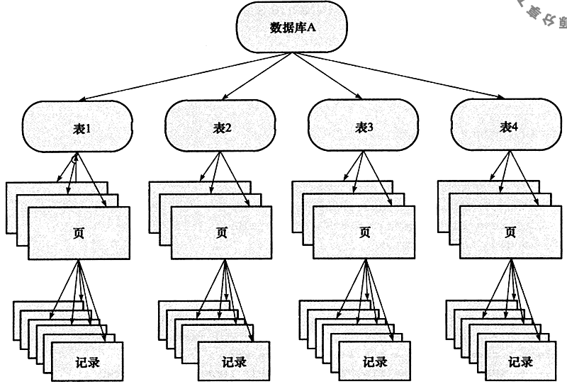
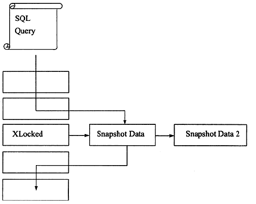

# 事务隔离级别

- READ UNCOMMITTED
    - 脏读。
- READ COMMITTED
    - Phantom Problem。在同一事务下，连续执行两次同样的SqL语句可能有不同的结果。
- REPEATABLE READ (默认)
    - 逻辑意义上的更新丢失问题。
- SERIALIZABLE

# 锁

lock的对象是事务，锁定的是数据库中的对象，如表，页，行。一般在事务commit和rollback后释放。

INNODB 存储引擎支持多粒度（granular）锁定，这种锁定允许事务在行级上的琐和表级上的锁同时存在。



## 锁的类型

- 表级锁
    - 共享锁（S Lock），会阻塞其他事务修改表数据。
    - 排他锁（X Lock），会阻塞其他事务读和写。
    - 意向共享锁（IS Lock），事务想要获得一张表中某几行的共享锁。
    - 意向排他锁（IX Lock），事务想要获得一张表中某几行的排他锁。
- 行级锁
    - 共享锁（S Lock），允许事务读一行数据，阻塞其他事务修改数据。
    - 排他锁（X Lock），允许事务删除或更新一行数据，阻塞其他事务读取和修改数据。

## 意向锁

- The main purpose of *IX* and *IS* locks is to show that someone is locking a row, or going to lock a row in the table.
- S and IX locks allow access by multiple clients. They won't  necessarily conflict until they try to get real locks on the same rows.But a table lock (ALTER TABLE, DROP TABLE, LOCK TABLES) blocks both IS and IX, and vice-versa。
- SELECT ... FOR SHARE sets an IS lock, and SELECT ... FOR UPDATE sets an IX lock.

|      | X        | IX         | S          | IS         |
| ---- | -------- | ---------- | ---------- | ---------- |
| X    | Conflict | Conflict   | Conflict   | Conflict   |
| IX   | Conflict | Compatible | Conflict   | Compatible |
| S    | Conflict | Conflict   | Compatible | Compatible |
| IS   | Conflict | Compatible | Compatible | Compatible |

- 思考题
    - 为什么要有意向锁？
    - 事务A和事务B都拿到了IX, 然后分别获取不同行的X锁，会死锁吗？

# 一致性的非锁定读（consistent nonlocking read）

在事务隔离级别 READ COMMIITTED 和 REPEATABLE READ ，InnoDB 通过行多版本并发控制（MVCC）的方式来读取数据库中的行数据，如果读取的行正在执行 DELETE 或 UPDATE 操作，这时读取操作不会去等待行上锁的释放。相反地，INNODB 存储引擎会去读取行的一个快照数据。

- 快照数据是通过undo来实现的。
- 快照数据不需要上锁，因为没有事务需要对历史数据修改。
- 在 READ COMMITTED 事务隔离级别下，对于快照数据，非一致性读总是读取被锁定行的最新一份快照数据。
- 在 REPEATABLE READ 事务隔离级别下，对于快照数据，非一致性读总是读取事务开始时的行数据版本。



# 一致性锁定读

- SELECT… FOR UPDATE：对读取的行记录加一个 X 锁，其他事务不能对已锁定的行加上任何锁。
- SELECT… LOCK IN SHARE MODE：对读取的行记录加一个 S 锁，其他事务可以向被锁定的行加 S 锁，但是如果加 X 锁，则会被阻塞。
- 必须在事务中，事务提交或者回顾，锁被释放。
- 对于外键值的插入或更新，首先需要査询父表中的记录，即 SELECT 父表。但是对于父表的 SELECT 操作，不是使用一致性非锁定读的方式，因为这样会发生数据不一致的问题，因此这时使用的是 SELECT… LOCK IN SHARE MODE 方式，即主动对父表加一个 S 锁。如果这时父表上已经加 X 锁，子表上的操作会被阻塞。

# 行锁算法

## Record Lock

单个行记录上的锁。Record Lock 总是会去锁住索引记录，如果 INNODB 存储引擎表在建立的时候没有设置任何一个索引，那么这时 INNODB 存储引擎会使用隐式的主键来进行锁定。

## Gap Lock

间隙锁，锁定一个范围，但不包含记录本身。

## Next- Key Lock

 Gap Lock+ Record Lock，锁定一个范围，并且锁定记录本身。

例如，一个索引有 1，2，5这三个值，Next- Key Lock可锁定的区间为：(-∞，1], (1, 2], (2, 5], (5,+∞)。

然而，当査询的索引含有唯一属性时，INNODB 存储引擎会对 Next- Key Lock 进行优化，将其降级为 Record Lock，即仅锁住索引本身，而不是范围。

能避免Phantom Problem问题。

## 例1

```SQL
DROP TABLE IE EXISTS t;

CREATE TABLE t (a INT PRIMARY KEY);

INSERT INTO t SELECT 1;

INSERT INTO t SELECT 2;

INSERT INTO t SELECT 5;


// session A

BEGIN;

SELECT * FROM t WHERE a=5 FOR UPDATE; // 仅锁定5，而不是(2，5]

COMMIT;

// session B

BEGIN;

INSERT INTO t SELECT 4;

COMMIT; //成功，不需要等待
```

## 例2

```SQL
CREATE TABLE z (a INT, b INT, PRIMARY KEY (a), KEY (b) );

INSERT INTO z SELECT 1,1;

INSERT INTO z SELECT 3,1;

INSERT INTO z SELECT 5,3;

INSERT INTO z SELECT 7,6; 

INSERT INTO z SELECT 10,8;


// session A

// 需要分别锁定两个索引，对于聚集索引，加上Record Lock, 对于辅助索引，加上Next-Key Lock, 

// (1,3]。InnoDB 还会对辅助索引加一个Gap Lock, （3，6)。

SELECT * FROM z where b=3 FOR UPDATE;


// session B

SELECT * FROM z WHERE a=5 LOCK IN SHARE MODE; // 被阻塞

INSERT INTO z SELECT 4,2; // 被阻塞

INSERT INTO z SELECT 6,5; // 被阻塞
```

思考题：

- 为什么要加（3，6）的Gap Lock?

# 解决更新丢失问题

| 事务A         | 事务B                   |
| ------------- | ----------------------- |
| 读取账户100元 | 读取账户100元           |
| 转账99元      |                         |
| commit        |                         |
|               | 转账1元，结果还剩下99元 |
|               | commit                  |

串行执行，在事务读账户余额是加X锁（SELECT… FOR UPDATE）。

# 参考资料

[mysql官网](https://dev.mysql.com/doc/refman/8.0/en/innodb-locking.html#innodb-shared-exclusive-locks)

《MySQL技术内幕(InnoDB存储引擎)第2版》