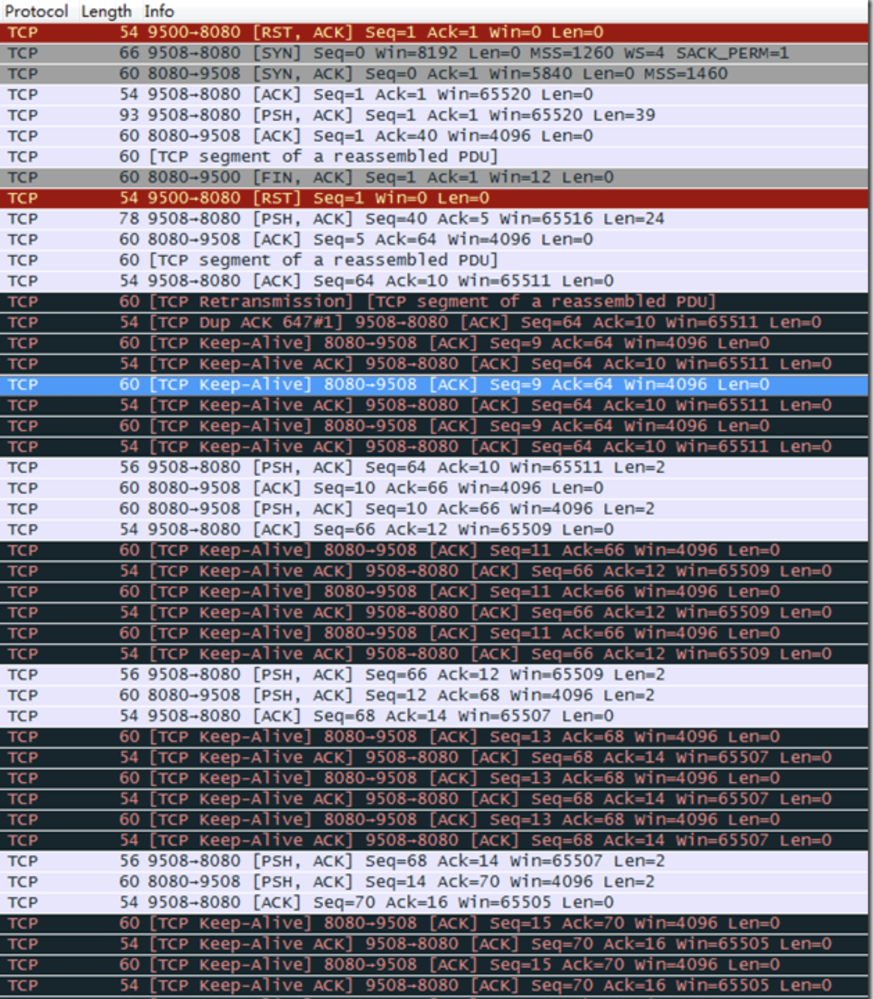

# keep-alive

作用：

避免无效的资源占用。如对方挂掉，NAT 等踢掉了连接等

原理：

发送探测包，SEG.SEQ = SND.NXT-1，而 SND.NXT = RCV.NXT，即发送的包 seq 为上一个已确认包的 seq号，由于该包已经被确认了，对方不会解析包，而是直接回复 ACK。

由于纯 ACK 包，不会有任何的 ACK，一些 TCP 实现可能不回复，为了避免这种问题，可以包含1个无意义的字节，比如0x0（[RFC1122#TCP Keep-Alives](https://tools.ietf.org/html/rfc1122#section-4.2.3.6)规范建议：不应该包含任何数据）。

Ref: 

- http://www.52im.net/thread-3506-1-1.html

- https://datatracker.ietf.org/doc/html/rfc1122#page-101